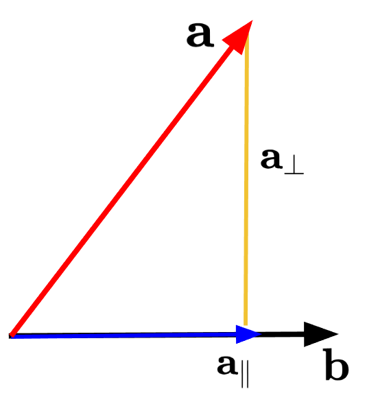

## Index
  - Introduction

  - BA Formulation
  
  - Adaptive Voxelization
  
  - LOAM with Local BA
  
  - Experimental 

  - Conclusion
---
## Introduction
.nt-02.pull-left[

]
.nt-02.pull-right[

]
.f-90[
- **Visual BA** : 동일한 feature point에 대한 다중 관측 제약
  
- **Sparse LiDAR**에선 point-to-point BA보다, point-to-plane/line BA 
  
- **LiDAR BA in BALM** : faeture points가 동일한 planar/edge위 존재하도록 함`
]
---
## BA Formulation
.nt-02.center[

]
.f-80[
  - M개의 스캔으로부터 얻어졌지만 모두 같은 feature(planar/edge)에 해당되는 sparse feature points $p_{fi}$그룹
    - $\mathbf{T}_j = (\mathbf{R}_j, \mathbf{t}_j) \in SO(3) \times \mathbb{R}^3$, $j=(1,...,M)$ 
    - $p_i$: global frame의 feature point 
]

$$\mathbf{p}_i = R_{s_i} \mathbf{p}_{f_i} + \mathbf{t}_{s_i} ; i = 1, \ldots, N.$$
---
## BA Formulation
.nt-02.f-90[
- mean, covariance 정의

$$\bar{\mathbf{p}} = \frac{1}{N} \sum_{i=1}^{N} \mathbf{p}_i; A = \frac{1}{N} \sum_{i=1}^{N} (\mathbf{p}_i - \bar{\mathbf{p}})(\mathbf{p}_i - \bar{\mathbf{p}})^T$$

- Local BA 문제 정의(Planar)]
.f-95[
$$\begin{align*}
(\mathbf{T}^*, \mathbf{n}^*, \mathbf{q}^*) &= \arg \min_{T,n,q} \frac{1}{N} \sum_{i=1}^N (\mathbf{n}^T (\mathbf{p}_i - \mathbf{q}))^2 \\
&= \arg \min_{T} \left( \underbrace{\min_{n,q} \frac{1}{N} \sum_{i=1}^N (\mathbf{n}^T (\mathbf{p}_i - \mathbf{q}))^2}_{=\lambda_3(\mathbf{A}); \text{ if } \mathbf{n}^*=\mathbf{u}_3, \mathbf{q}^*=\bar{\mathbf{p}}} \right)
\end{align*}$$
]
.f-90[
- planar feature의 **최적 파라미터 (n,q)를 closed-form**으로 구해 **pose-only BA** 문제로 변환 
]
???
u3는 covariance A의 세번째 eigenvector, 즉 가장 작은 eigenvalue에 대응하는 벡터
planar feature에서는 평면법선방향, 점들이 가장 덜 퍼지는 방향
밑에 if는 최소값을 달성하는 최적값이 저것들임!
이거 증명방법은 [pi-q = (pi-p바) + (p바-q)]로 대입해서 풀면 결국에는 n^TAn으로 나옴.
planar에서 lamda3인 이유는 평면 법선 분산 방향이 가장 작아야 하기 때문임. 그래서 가장 작은 eigenvalue에 대응하는 eigenvector가 법선벡터가 되는 것임.
즉, 평면 안 두 방향의 분산은 커도됨. 근데 수직한 방향은 작아야함.
**plane은 2차원 구조이므로 한방향만 얇아야함. 그 얇은 방향이 법선방향이기 때문에 분산이 가장작은 고유값이어서 lamda3가 cost가 됨**
---
## BA Formulation
.nt-02.f-90[
- Local BA 문제 정의(Edge)
]
.f-95[
$$\begin{align*}
(\mathbf{T}^{*}, \mathbf{n}^{*}, \mathbf{q}^{*}) &= \underset{\mathbf{T}, \mathbf{n}, \mathbf{q}}{\arg \min} \frac{1}{N} \sum_{i=1}^{N} \left\|\left(\mathbf{I} - \mathbf{n n}^{T}\right)\left(\mathbf{p}_{i} - \mathbf{q}\right)\right\|_{2}^{2} \\
&= \underset{\mathbf{T}}{\arg \min} \underbrace{\left(\underset{\mathbf{n}, \mathbf{q}}{\min} \frac{1}{N} \sum_{i=1}^{N} \left\|\left(\mathbf{I} - \mathbf{n n}^{T}\right)\left(\mathbf{p}_{i} - \mathbf{q}\right)\right\|_{2}^{2}\right)}_{=\text{Tr}(\mathbf{A})-\lambda_{1}(\mathbf{A})=\lambda_{2}(\mathbf{A})+\lambda_{3}(\mathbf{A}); \text{ if } \mathbf{n}^{*}=\mathbf{u}_{1}, \mathbf{q}^{*}=\overline{\mathbf{p}}}
\end{align*}$$
- edge feature의 **최적 파라미터 (n,q)를 closed-form**으로 구해 **pose-only BA** 문제로 변환 
]

.f-90[
- 최적화 대상은 voxel하나의 egienvalue cost
$$\lambda_k(\mathbf{p}(\mathbf{T}))$$
  - $\mathbf{T}$에 대해, $\mathbf{p} = \left[ \mathbf{p}_1^T \ \cdots \ \mathbf{p}_N^T \right]^T$는 동일한 feautre point의 벡터
]
???
이거도 증명과정 planar랑 똑같이 [pi-q = (pi-p바) + (p바-q)]로 대입해서 풀면 결국에는 Tr(A) - lambda1이 나옴
(I-nn^T) : n에 수직한 평면의 projection
(I-nn^T)(pi-q) : 점 pi가 pi-q 벡터에서 얼머나 옆으로 벗어났는가?
norm제곱으로 점에서 직선까지의 제곱거리 => 점들이 어떤 한 edge line에 최대한 가깝에 하자! 
edge에서는 line방향 분산 lamda1는 커도됨. 근데 나머지 두 수직방향 2,3는 작아야함 그래서 Tr(A) - lambda1이 최소가 되는 지점이 최적점이 되는 것임.
**edge는 1차원 구조이므로 한방향만 길고, 나머지는 얆아야함 그래서 큰 방향 lamda1는 남기고 수직방향 lambda2+lambda3가 cost가 됨**
---
## BA Formulation
.nt-02.f-90[
- 점 $\mathbf{p}_i$에 대한 고유값 $\lambda_k$가 얼마나 변하는지, 1차미분 **Gradient**
  - planar voxel이면 $\lambda_3$, edge voxel이면 $\lambda_2 + \lambda_3$
  - 개별 $\lambda_k$에 대한 미분 공식]

$$
\frac{\partial \lambda_k}{\partial \mathbf{p}_i}
= \frac{2}{N} (\mathbf{p}_i - \bar{\mathbf{p}})^T \mathbf{u}_k \mathbf{u}_k^T
$$

.f-90[
- **Gradient**를 점 $\mathbf{p}_j$에 대해 미분한, 2차미분 **Hessian**
  - $i=j$일경우 같은점 $\mathbf{p}_i$를 두번 미분. self-curvature
  - $i\neq j$일경우 서로 다른점 $\mathbf{p}_i, \mathbf{p}_j$ 사이의 교차 미분. cross-coupling
]

$$
\frac{\partial^2 \lambda_k}{\partial \mathbf{p}_j \partial \mathbf{p}_i}
=
\begin{cases}
\frac{2}{N}
\left(
\frac{N-1}{N}\mathbf{u}_k \mathbf{u}_k^T
+
\mathbf{u}_k (\mathbf{p}_i-\bar{\mathbf{p}})^T \mathbf{UF}_k^{p_j}
+
\mathbf{UF}_k^{p_j}\mathbf{u}_k^T(\mathbf{p}_i-\bar{\mathbf{p}})
\right),
& i=j, \\[1ex]
\frac{2}{N}
\left(
-\frac{1}{N}\mathbf{u}_k \mathbf{u}_k^T
+
\mathbf{u}_k (\mathbf{p}_i-\bar{\mathbf{p}})^T \mathbf{UF}_k^{p_j}
+
\mathbf{UF}_k^{p_j}\mathbf{u}_k^T(\mathbf{p}_i-\bar{\mathbf{p}})
\right),
& i\neq j.
\end{cases}
$$
???
Gradient수식은 점 pi가 uk방향으로 평균에서 벗어나 있을수록 그 점은 $lambda_k$에 더 큰 영향을 미친다는 것을 보여줌
즉, voxel의 eigenvalue는 voxel내 점들의 uk방향으로의 퍼짐 정도에 민감하게 반응함

Hessian에서 i=j인 경우 내 점을 움직이면 내점도 변하고 평균도 같이 변함
i=/j인 경우 다른점을 움직이면 내 점은 안변하고 평균만 변함
첫번째항은 점-평균구조에 생김. 같은점 미분시 자기자신 영향 큼 / 다른점 미분시 평균통해서간 간점영향 부호가 음수
두번째항은 고유벡터 uk가 바뀌는항.
세번째항은 고유벡터 변화항
1. 평균점의 직접변화
2. eigenvector 변화 / eigenvector 변화의 대칭짝
---
## BA Formulation
.nt-02.f-90[
  - 점 $\mathbf{p}_i$를 움직였을때 고유벡터 $\mathbf{u}_k$의 변화
    - $\mathbf{F}_{k}^{\mathbf{P}_{j}}$는 $\mathbf{p}_j$에 대한 $\mathbf{u}_k$의 변화량을 나타내는 3x3 행렬. 즉 **eignevector senstivity**
]

$$\mathbf{F}_{k}^{\mathbf{P}_{j}} = \begin{bmatrix}
\mathbf{F}_{1,k}^{\mathbf{P}_{j}} \\
\mathbf{F}_{2,k}^{\mathbf{P}_{j}} \\
\mathbf{F}_{3,k}^{\mathbf{P}_{j}}
\end{bmatrix} \in \mathbb{R}^{3 \times 3}, \quad \mathbf{U} = [\mathbf{u}_1 \ \mathbf{u}_2 \ \mathbf{u}_3]$$

.f-90[
  - $\mathbf{F}_{m,n}^{\mathbf{p}_j}$는 고유벡터들 사이의 coupling 합
    - $m\neq n$인 경우, 서로 다른 eigendirection 사이의 coupling
    - $m=n$인 경우, 자기자신의 변화는 고유벡터 변화에 영향 없음
]

$$\mathbf{F}_{m,n}^{\mathbf{p}_j} = \begin{cases}
\frac{(\mathbf{p}_j - \bar{\mathbf{p}})^T}{N(\lambda_n - \lambda_m)}(\mathbf{u}_m \mathbf{u}_n^T + \mathbf{u}_n \mathbf{u}_m^T), & m \neq n \\
\mathbf{0}_{1 \times 3}, & m = n
\end{cases}$$

???
-$\mathbf{F}_{m,n}^{\mathbf{p}_j}$
(pj-pbar)는 pj가 평균에서 얼마나 떨어졌는지
(um um^T + un um^T)는 고유벡터 변화가 다른 고유벡터 방향으로 섞이는 회전
N(lambda_n - lambda_m)는 고유값 차이로, 차이작 작으면 민감하게 / 차이가 크면 안정적
---
## BA Formulation
.nt-02.f-75[
  - voxel 하나의 egienvalue cost에 대한 2차식 근사
$$\lambda_k(\mathbf{p} + \boldsymbol{\delta p}) \approx \lambda_k(\mathbf{p}) + \mathbf{J}(\mathbf{p})\boldsymbol{\delta p} + \frac{1}{2}\boldsymbol{\delta p}^T \mathbf{H}(\mathbf{p})\boldsymbol{\delta p}$$
- scan에서 feature point가 global frame에서의 움직임
$$\mathbf{p}_i = \mathbf{R}_{s_i} \exp(\phi_{s_i}^\wedge) \mathbf{p}_{f_i} + \mathbf{t}_{s_i}; \frac{\delta \mathbf{p}_i}{\delta \mathbf{T}_{s_i}} = \left[ -\mathbf{R}_{s_i} (\mathbf{p}_{f_i})^\wedge \quad \mathbf{I} \right]$$
- voxel 하나의 egienvalue cost를 pose incremenst $\delta \mathbf{T}$에 대한 2차식으로 근사
$$\lambda_k(\mathbf{T} \boxplus \delta\mathbf{T}) \approx \lambda_k(\mathbf{T}) + \underbrace{\mathbf{JD}}_{\bar{\mathbf{J}}} \delta\mathbf{T} + \frac{1}{2} \delta\mathbf{T}^T \underbrace{\mathbf{D}^T \mathbf{HD}}_{\bar{\mathbf{H}}} \delta\mathbf{T}$$
- Levenberg-Marquardt 업데이트 공식
$$(\bar{\mathbf{H}}(T) + \mu \mathbf{I})\delta \mathbf{T}^* = -\bar{\mathbf{J}}(T)^T$$
]
???
첫번째식 : point 기준 2차 근사. voxel cost 람다를 point-space에서2차 근사
두번째식 : point와 pose의 관계식. pose perturbation이 point를 어떻게 움직이는지
세번째식 : 핵심. 실제 최적화 변수인 pose로 바꾼 결과.즉 pose기준 2차 근사. point-space quadratic을 pose-space quadratic으로 변경
네번째식 : Levenberg-Marquardt 업데이트 공식
---
## Adaptive Voxelization
.nt-02.pull-left[

]

.pull-right-53.f-80[
  - Rough pose를 이용해 multi-scan fature points를 정렬
- 3D 공간을 voxel 단위로 분할
  
- 각 voxel 내부 점군의 covariance eigenvaluse로 planar/edge 구조 판별
  
- 하나의 feature로 보기 어려운 voxel은 세분화
  
- 각 voxel을 하나의 geometirc feature 및 cost item으로 활용  
]
???
(a),(b)는 실제실험사진
---
## Adative Voxelization
.nt-02.f-90[
- **Remak1**
  - voxel안 점이 너무 많으면 Hessian 차원이 커지므로, **같은 scan에서 온 점들을 평균화해도 된다**
  - raw feature point가 정의한 same plane위에 있으면, 계산을 줄이면서 consistency는 유지함

- **Remark2**
  - Hessian은 $\lambda_i \neq \lambda_k$를 필요하므로 수치적으로 불안정한 voxel은 BA에서 제외

- **Remak3**
  - voxel을 세밀하게 만들고 **same plane** 검사 허용 오차를 기우면 curved surface같은 것도 대응 가능

- **Remark4**
  - recursive subdivision은 **max depth**와 **minimum number of points** 조건으로 멈춤
]
---
## LOAM with Local BA
.nt-02.pull-left-50[

]
.nt-07.pull-right-50.f-80[
- **Feature Extratcion** 
  - Raw point에서 edge/planar feature point 추출
  
- **Odometry (Rough Pose Estimation)**
  - 새 scan을 기존 map 정합하여 rough pose 추정

- **Adaptive Voxelization/Voxel Map Update**
  - 정렬된 faeture point를 **edge/planar voxel map** 생성
  - eigenvalue 기반 검사과 8-octant를 이용해 feature corresopondence 생성
  
- **Map Refinement (Local BA)**
  - sliding window $\mathbf{P}_{sw}$안의 voxel들을 통해 eigenvalue기반 cost 생성
  - pose-only BA로 pose 업데이트
  
- **Marginalization**
  - 오래된 정보는 $\mathbf{P}_{fix}$로 요약된 형태로 보존  
  ]
???
feature extraction으로 sparse feature를 만들고 → 
odometry가 rough pose를 구해 새 scan을 voxel map에 넣고 → 
adaptive voxelization이 correspondence를 만들고 → 
map-refinement가 sliding window local BA로 pose를 다시 고치고 → 
오래된 정보는 Pfix로 요약 보존하는 구조
---
## LOAM with Local BA
.nt-02.f-90[
- **Feature extraction** : raw point에서 edge/planar feature point 추출
  
- **Odometry** : 새로운 scan의 initail pose estimation
  
- **Global alignment** : odometry pose를 통해서 feature point을 global map frame으로 정렬
  
  $$\mathbf{p}_i = R_{s_i} \mathbf{p}_{f_i} + \mathbf{t}_{s_i} ; i = 1, \ldots, N.$$
- **Adaptive Voxelization** : edge/planar Voxel map에 feature point를 삽입하고 Adative subdivision 수행
  
- **Local BA** : voxel의 mean/covariance를 통해 eigenvalue 기반 cost로 local BA 수행
  
- **Update** : pose와 Voxel 업데이트, 오래된 점은 marginalize
]
---
## Experimental
.nt-02.f-90[
- **Use LiDAR Livox Horizon**]
.nt-02.pull-left-50[

]
.nt-02.pull-right-50[
  
]
---
## Experimental
.nt-02.f-90[
  - **Use LiDAR Livox Mid40**]
.center[

]
---
## Experimental
.nt-02.f-90[
  - **Use LiDAR Velodyne VLP-16**]
.nt-02.pull-left-50[

]
.nt-02.pull-right-50[
  
]
---
## Experimental
.center[

]
- BALM은 drift를 줄이고, 실행시간도 실용적임을 보여줌
- local BA와 voxel update를 적용한 BALM이 대부분 빠르게 완료됨
---
## Conclusion
.nt-02.f-90[
- **Closed form feature elimination기반 LiDAR BA Formulation**
  - planar/edge feature의 최적 파라미터를 closed-form으로 구해서 pose-only BA 문제로 변환
  
- **Gradient/Hessian 기반 second-order optimization**
  - eigenvalue cost에 대한 gradient/hessian을 closed-form으로 유도
  
- **Adaptive Voxelization기반 효율적인 edge/planar correspondence**
  - 같은 edge/planar에 속하는 feature points를 하나의 voxel로 묶어서 local BA에 활용
]
---
## Appendix
.nt-02.pull-left-45[

]
.nt-02.f-90[
  - Projection
]
.nt-02.pull-right-55.f-90[
  - Projection Vector
  - 크기 :  
$$\mathbf{a} \cdot \mathbf{b} = \|\mathbf{a}\|\|\mathbf{b}\|\cos\theta = (\|\mathbf{a}\|\cos\theta)\|\mathbf{b}\|$$
$$\frac{\mathbf{a} \cdot \mathbf{b}}{\|\mathbf{b}\|} = \|\mathbf{a}\|\cos\theta = \|\mathbf{a}_{\parallel}\|$$

  - 방향 : $\hat{\mathbf{b}} = \frac{\mathbf{b}}{\|\mathbf{b}\|}$
  - 방향 x 크기
$$\therefore \mathbf{a}_{\parallel} = \|\mathbf{a}_{\parallel}\| \cdot \hat{\mathbf{a}}_{\parallel} = \frac{\mathbf{a} \cdot \mathbf{b}}{\|\mathbf{b}\|} \cdot \frac{\mathbf{b}}{\|\mathbf{b}\|} = \frac{(\mathbf{b}\mathbf{b}^T)}{\mathbf{b}^T\mathbf{b}}\mathbf{a}$$
]
---
## Appendix (Proof Theorem1)
.nt-02.f-90[
  - 1차 미분(gradient)
  - planar cost : $\lambda_3(\mathbf{A})$ / edge cost : $\lambda_2(\mathbf{A}) + \lambda_3(\mathbf{A})$
- 점 $p_i$를 움직였을때 $\mathbf{A}$의 k번째 eigenvalue $\lambda_k$가 얼마나 변하는가? 를 의미함
$$
\frac{\partial \lambda_k}{\partial \mathbf{p}_i}
= \frac{2}{N} (\mathbf{p}_i - \bar{\mathbf{p}})^T \mathbf{u}_k \mathbf{u}_k^T  \tag{6}
$$
- $\mathbf{p}_i=[x_i, y_i, z_i]^T$이고, eigenvector matrix $\mathbf{U}=[\mathbf{u}_1, \mathbf{u}_2, \mathbf{u}_3]^T$ 로 정의시 

$$
\Lambda = \mathbf{U}^{\top} \mathbf{A} \mathbf{U}
\qquad
\Lambda =
\begin{bmatrix}
\lambda_1 & 0 & 0 \\
0 & \lambda_2 & 0 \\
0 & 0 & \lambda_3
\end{bmatrix}
$$
]

=> $\mathbf{A}$는 eigenvector basis에서 대각화된 형태로 표현됨
---
## Appendix (Proof Theorem1)
.nt-02.f-90[
  - 왜 $\Lambda = \mathbf{U}^{\top} \mathbf{A} \mathbf{U}$인가?
  - covariance matrix $\mathbf{A} = \frac{1}{N} \sum_{i=1}^{N} (\mathbf{p}_i - \bar{\mathbf{p}})(\mathbf{p}_i - \bar{\mathbf{p}})^\top$
  - $\mathbf{A}^\top = \mathbf{A}$이므로 대칭행렬 : $((\mathbf{p}_i - \bar{\mathbf{p}})(\mathbf{p}_i - \bar{\mathbf{p}})^\top)^\top = (\mathbf{p}_i - \bar{\mathbf{p}})(\mathbf{p}_i - \bar{\mathbf{p}})^\top$
- $\mathbf{U} = [\mathbf{u}_1 \ \mathbf{u}_2 \ \mathbf{u}_3], \qquad \Lambda = \begin{bmatrix} \lambda_1 & 0 & 0 \\ 0 & \lambda_2 & 0 \\ 0 & 0 & \lambda_3 \end{bmatrix}$
- $\mathbf{A}\mathbf{u}_k = \lambda_k \mathbf{u}_k ... (k=1,2,3)$들을 $\mathbf{AU} = \mathbf{U}\Lambda$라고 표현할 수 있음
- $\mathbf{AU}=[\mathbf{A}\mathbf{u}_1 \ \mathbf{A}\mathbf{u}_2 \ \mathbf{A}\mathbf{u}_3] = [\lambda_1 \mathbf{u}_1 \ \lambda_2 \mathbf{u}_2 \ \lambda_3 \mathbf{u}_3]$
- $\mathbf{U}\Lambda = [\,\mathbf{u}_1\ \mathbf{u}_2\ \mathbf{u}_3\,] \begin{bmatrix} \lambda_1 & 0 & 0 \\ 0 & \lambda_2 & 0 \\ 0 & 0 & \lambda_3 \end{bmatrix} = [\,\lambda_1 \mathbf{u}_1\ \lambda_2 \mathbf{u}_2\ \lambda_3 \mathbf{u}_3\,]$
- $\mathbf{AU} = \mathbf{U}\Lambda$이므로 양변에 $\mathbf{U}^T$를 곱하면 $\Lambda = \mathbf{U}^T \mathbf{A} \mathbf{U}$
]
---
## Appendix (Proof Theorem1)
.nt-02.f-90[
  - $\Lambda=\mathbf{U}^{\top} \mathbf{A} \mathbf{U}$를 $p$에 대한 미분
$$
\frac{\partial \Lambda}{\partial p} = \left(\frac{\partial \mathbf{U}}{\partial p}\right)^T \mathbf{A} \mathbf{U} + \mathbf{U}^T \frac{\partial \mathbf{A}}{\partial p} \mathbf{U} + \mathbf{U}^T \mathbf{A} \frac{\partial \mathbf{U}}{\partial p} \tag{18}
$$
- $\mathbf{AU}=\mathbf{U}\Lambda, \mathbf{U^{\top}A}=\Lambda \mathbf{U}^\top$를 통해 정리 가능
- 첫번째항 : $\left(\frac{\partial \mathbf{U}}{\partial p}\right)^T \mathbf{A} \mathbf{U} = \left(\frac{\partial \mathbf{U}}{\partial p}\right)^T \mathbf{U} \Lambda$ / 세번째항 : $\mathbf{U}^T \mathbf{A} \frac{\partial \mathbf{U}}{\partial p} = \Lambda \mathbf{U}^T \frac{\partial \mathbf{U}}{\partial p}$
]

$$\frac{\partial \Lambda}{\partial p} = \mathbf{U}^T \frac{\partial \mathbf{A}}{\partial p} \mathbf{U} + 
\underbrace{\Lambda \mathbf{U}^T \frac{\partial \mathbf{U}}{\partial p}}_{\text{C}^p} + 
\underbrace{\left(\frac{\partial \mathbf{U}}{\partial p}\right)^T \mathbf{U} \Lambda}_{\text{(C}^p\text{)}^T}$$

.f-90[
- $\mathbf{C}^p = \Lambda \mathbf{U}^T \frac{\partial \mathbf{U}}{\partial p}$ / ${\mathbf{C}^p}^T = \left(\frac{\partial \mathbf{U}}{\partial p}\right)^T \mathbf{U} \Lambda$
- $\mathbf{C}^p$의 역할은 eigenvector matrix $\mathbf{U}$의 변화율, eigenbasis안에서 표현함
]
---
## Appendix (Proof Theorem1)
.nt-02.f-90[
  - $\mathbf{U}$의 각 열이 단위벡터로 Orthogonal이므로 $\mathbf{U}^T \mathbf{U} = \mathbf{I}$를 $\mathbf{p}$에 대해 미분
$$\frac{\partial U^T}{\partial p}\mathbf{U} + \mathbf{U}^T \frac{\partial U}{\partial p} = 0$$
$$(\mathbf{C}^p)^T + \mathbf{C}^p = 0 \rightarrow (\mathbf{C}^p)^T = -\mathbf{C}^p$$
- 따라서 $\mathbf{C}^p$는 skew-symmetric matrix임
$$
\frac{\partial \Lambda}{\partial p} = \mathbf{U}^T \frac{\partial \mathbf{A}}{\partial p} \mathbf{U} + \color{red}{\Lambda\mathbf{C}^p} + \color{red}{(\mathbf{C}^p)^T\Lambda} = \mathbf{U}^T \frac{\partial \mathbf{A}}{\partial p} \mathbf{U}
$$
$$
\frac{\partial \lambda_k}{\partial p} = \mathbf{u}_k^T \frac{\partial \mathbf{A}}{\partial p} \mathbf{u}_k = \frac{\partial (\mathbf{u}_k^T \mathbf{A} \mathbf{u}_k)}{\partial p} \quad (k = 1, 2, 3) \tag{a}
$$
- 따라서 대각성분만 보면 eigenvector derivate를 직접 계산을 할 필요가 없어짐
]

---
## Appendix (Proof Theorem1)
.nt-02.f-90[
  - $\mathbf{A} = \frac{1}{N} \sum_{i=1}^{N} (\mathbf{p}_i - \bar{\mathbf{p}})(\mathbf{p}_i - \bar{\mathbf{p}})^\top$를 (a)에 대입하고 $\mathbf{p}_i = [x_i, y_i, z_i]^\top$에 대한 편미분
$$\frac{\partial \lambda_k}{\partial \mathbf{p}_i} = 
\begin{bmatrix} \frac{\partial \mathbf{u}_k^\top \mathbf{A} \mathbf{u}_k}{\partial x_i} & \frac{\partial \mathbf{u}_k^\top \mathbf{A} \mathbf{u}_k}{\partial y_i} & \frac{\partial \mathbf{u}_k^\top \mathbf{A} \mathbf{u}_k}{\partial z_i} \end{bmatrix} = 
\frac{\partial \mathbf{u}_k^\top \mathbf{A} \mathbf{u}_k}{\partial \mathbf{p}_i}$$
- 대입하고 $\mathbf{p}_i$에 대해 미분
$$\begin{aligned}
\frac{\partial \lambda_k}{\partial \mathbf{p}_i}
&=
\frac{\partial \mathbf{u}_k^{\top}\mathbf{A}\mathbf{u}_k}{\partial \mathbf{p}_i} \\
&=
\frac{1}{N}\sum_{j=1}^{N}
\frac{\partial \mathbf{u}_k^{\top}(\mathbf{p}_j-\bar{\mathbf{p}})(\mathbf{p}_j-\bar{\mathbf{p}})^{\top}\mathbf{u}_k}
{\partial \mathbf{p}_i} \\
&=
\frac{2}{N}\sum_{j=1}^{N}
(\mathbf{p}_j-\bar{\mathbf{p}})^{\top}\mathbf{u}_k\,
\frac{\partial\left(\mathbf{u}_k^{\top}(\mathbf{p}_j-\bar{\mathbf{p}})\right)}
{\partial \mathbf{p}_i}
\end{aligned}$$
]
---
## Appendix (Proof Theorem1)
.nt-02.f-90[
- i=j면 $\mathbf{p}_i$를 $\mathbf{p}_i$로 미분하니까 $\mathbf{I}$, i=/j면 $\mathbf{p}_i$를 $\mathbf{p}_j$로 미분하니까 0
$$\frac{\partial \mathbf{p}_j}{\partial \mathbf{p}_i} = \mathbf{I}, (i = j) 
\qquad \frac{\partial \mathbf{p}_j}{\partial \mathbf{p}_i} = 0, (i \neq j),$$
  - i : 미분하려는 point index / j : covariance 합을 도는 index
- $\bar{\mathbf{p}} = \frac{1}{N} \sum_{i=1}^{N} \mathbf{p}_i$에 대해 미분
$$\frac{\partial \bar{\mathbf{p}}}{\partial \mathbf{p}_i} = \frac{1}{N} \mathbf{I}$$
$$\frac{\partial(p_j - \bar{p})}{\partial p_i} = 
\begin{cases} 
I - \frac{1}{N}I, & i = j \\ 
-\frac{1}{N}I, & i \neq j 
\end{cases}$$
- 즉, 자기자신도 변하고, 평균도 같이 변한다는 것을 보여줌
]
---
## Appendix (Proof Theorem1)
.nt-02.f-90[
  - $\mathbf{p}_i$에 대한 편미분을 대입해서 정리
$$\begin{align*}
\frac{\partial \lambda_k}{\partial \mathbf{p}_i} &= \frac{1}{N} \sum_{j=1}^{N} \frac{\partial}{\partial \mathbf{p}_i} \left( \mathbf{u}_k^\top (\mathbf{p}_j - \bar{\mathbf{p}})(\mathbf{p}_j - \bar{\mathbf{p}})^\top \mathbf{u}_k \right) \\[1ex]
&= \frac{2}{N} \sum_{j=1}^{N} (\mathbf{p}_j - \bar{\mathbf{p}})^\top \mathbf{u}_k \frac{\partial(\mathbf{u}_k^\top (\mathbf{p}_j - \bar{\mathbf{p}}))}{\partial \mathbf{p}_i} \\[1ex]
&= \frac{2}{N} (\mathbf{p}_i - \bar{\mathbf{p}})^\top \mathbf{u}_k \mathbf{u}_k^\top \left( I - \frac{1}{N}I \right) + \frac{2}{N} \sum_{j \neq i} (\mathbf{p}_j - \bar{\mathbf{p}})^\top \mathbf{u}_k \mathbf{u}_k^\top \left( -\frac{1}{N}I \right) \\[1ex]
&= \frac{2}{N} (\mathbf{p}_i - \bar{\mathbf{p}})^\top \mathbf{u}_k \mathbf{u}_k^\top.
\end{align*}  \tag{19}$$
- $\mathbf{A}$를 점들로 전개후, 평균 $\bar{\mathbf{p}}$가 $\mathbf{p}_i$에도 의존하기 때문에 $i=j$인 경우와 $i \neq j$인 경우로 나눠서 미분하면 $\sum_{j=1}^{N} (\mathbf{p}_j - \bar{\mathbf{p}}) = 0$을 이용해 유도 가능
]
---
## Appendix (Proof Theorem2)
.nt-02.f-90[
  - 2차 미분(Hessian)
$$\frac{\partial^2 \lambda_k}{\partial p_j \partial p_i} \tag{7}$$
- 두 점 $\mathbf{p}_i=[x_i, y_i, z_i]^\top$와 $\mathbf{p}_j=[x_j, y_j, z_j]^\top$가 있고, $\mathbf{p}_j$의 한 좌표를 $\mathbf{q}$라고 함
- eigenvector matrix $\mathbf{U}$는 Orthogonal하므로
$$\mathbf{U}^\top \frac{\partial \mathbf{U}}{\partial \mathbf{q}} + \left( \frac{\partial \mathbf{U}}{\partial \mathbf{q}} \right)^\top \mathbf{U} = 0$$
- Theorem1에서 $\mathbf{C}^p = \Lambda \mathbf{U}^\top \frac{\partial \mathbf{U}}{\partial p}$가 skew-symmetric matrix이므로
$$\mathbf{C}^q = \mathbf{U}^\top \frac{\partial \mathbf{U}}{\partial \mathbf{q}}, \mathbf{C}^q+(\mathbf{C}^q)^\top = 0$$
]
---
## Appendix (Proof Theorem2)
.nt-02.f-90[
  - $\mathbf{C}^q$는 변수q가 바뀔 때 eigenvector matrix $\mathbf{U}$의 변화율을 eigenbasis안에서 표현한 것, 또한 skew-symmetric matrix이므로 $\mathbf{C}^q$의 대각성분은 0이고, 비대각성분은 서로 부호가 반대인 형태
- (18)번 수식의 q버전으로
$$\frac{\partial \Lambda}{\partial \mathbf{q}} = \mathbf{U}^\top \frac{\partial \mathbf{A}}{\partial \mathbf{q}} \mathbf{U} + \Lambda \mathbf{C}^q + (\mathbf{C}^q)^\top \Lambda = \mathbf{U}^\top \frac{\partial \mathbf{A}}{\partial \mathbf{q}} \mathbf{U} \tag{20}$$
- $\Lambda$는 diagonal matrix이고, $\frac{\partial \Lambda}{\partial \mathbf{q}}$의 또한 diagonal matrix으로 **off-diagonal**은 0이다.
- off-diagonal성분에 대해서, (m- row성분 / n-column성분)
$$0 = \mathbf{u}_m^T \frac{\partial A}{\partial q} \mathbf{u}_n + \lambda_m C^q_{m,n} - C^q_{m,n} \lambda_n \tag{b}$$
- Theorem1에서는 **점 자체와 평균점이 움직이면서 생기는 직접적인 변화**, 
- Theorem2에서는 **고유벡터 $\mathbf{u}_k$자체가 회전하면서 생기는 간접적인 영향**을 다루고 있음
]
---
## Appendix (Proof Theorem2)
.nt-02.f-90[
  - (b)수식에서 $\lambda_m \neq \lambda_n$인($m \neq n$) 경우, 서로 다른 eigendirection 사이의 coupling이 존재하므로
$$\mathbf{C}^q_{m,n} = \frac{1}{\lambda_n - \lambda_m}\mathbf{u}_m^T \frac{\partial A}{\partial q} \mathbf{u}_n \tag{21}$$
- (b)수식에서 $\lambda_m = \lambda_n$인($m = n$) 경우, 자기자신의 변화는 고유벡터 변화에 영향이 없으므로
$$\mathbf{C}^q_{m,n} = 0$$
- $\mathbf{C}^q_{m,n}$는 skew-symmetric이므로 diagonal 성분은 모두 0이고, off-diagonal성분은 서로 부호가 반대인 형태
- $m=n$인 경우는 자기 자신방향으로, 크기가 늘어나거나 줄어드는것이 아님. 따라서 **다른 eigenvector 방향의 영향만 나타냄**
- $m \neq n$인 경우 즉, 점 $p_j$를 조금 바꾸면 $u_n$은 자기 자신 방향으로 변하는것이 아닌 다른 **eigenvector 방향으로 회전하듯이 변함**
]
---
## Appendix (Proof Theorem2)
.nt-02.f-90[
  - $\mathbf{C}^q_{m,n}$에 정의에 따르면, 
$$\frac{\partial \mathbf{u}_k}{\partial q} = \frac{\partial \mathbf{U} \mathbf{e}_k}{\partial q} = \mathbf{U} \mathbf{C}^q \mathbf{e}_k \tag{c}$$
- $e_k$는 standard basis vector로, $k$번째 성분이 1이고 나머지는 0인 벡터
$$\frac{\partial (\mathbf{U}e_k)}{\partial q} = \frac{\partial\mathbf{U}}{\partial q} e_k$$
$$\mathbf{C}^q=\mathbf{U}^\top \frac{\partial \mathbf{U}}{\partial q} \rightarrow \frac{\partial \mathbf{U}}{\partial q} = \mathbf{U} \mathbf{C}^q$$
- 따라서 (c)가 유도됨
]
---
## Appendix (Proof Theorem2)
.nt-02.f-90[
  - $\frac {\partial \mathbf{u}_k}{\partial q}$는 $u_k$를 $p_j$의 모든 원소에 대한 미분을 벡터로 표현하면
$$\mathbf{p}_j=[x_j, y_j, z_j]^\top 
\rightarrow 
\frac{\partial \mathbf{u}_k}{\partial \mathbf{p}_j} = \left[ \frac{\partial {\mathbf{U}e_k}}{\partial x_j}, \frac{\partial {\mathbf{U}e_k}}{\partial y_j}, 
\frac{\partial {\mathbf{U}e_k}}{\partial z_j} \right]^\top
= \left[ \frac{\partial \mathbf{u}_k}{\partial x_j}, 
\frac{\partial \mathbf{u}_k}{\partial y_j}, 
\frac{\partial \mathbf{u}_k}{\partial z_j} \right]^\top$$
- 즉, $\mathbf{u}_k$가 point $\mathbf{p}_j$의 각 좌표 변화에 대해 어떻게 변하는지를 나타내는 벡터

$$\begin{align*}
\frac{\partial \mathbf{u}_k}{\partial \mathbf{p}_j} &= \left[ \frac{\partial \mathbf{U} \mathbf{e}_k}{\partial x_j} \quad \frac{\partial \mathbf{U} \mathbf{e}_k}{\partial y_j} \quad \frac{\partial \mathbf{U} \mathbf{e}_k}{\partial z_j} \right] \\
&= \left[ \mathbf{U}\mathbf{C}^{x_j} \mathbf{e}_k \quad \mathbf{U}\mathbf{C}^{y_j} \mathbf{e}_k \quad \mathbf{U}\mathbf{C}^{z_j} \mathbf{e}_k \right] \\
&= \mathbf{U} \left[ \mathbf{C}^{x_j} \mathbf{e}_k \quad \mathbf{C}^{y_j} \mathbf{e}_k \quad \mathbf{C}^{z_j} \mathbf{e}_k \right] \\
&= \mathbf{U} \begin{bmatrix}
\mathbf{C}^{x_j}_{1,k} & \mathbf{C}^{y_j}_{1,k} & \mathbf{C}^{z_j}_{1,k} \\
\mathbf{C}^{x_j}_{2,k} & \mathbf{C}^{y_j}_{2,k} & \mathbf{C}^{z_j}_{2,k} \\
\mathbf{C}^{x_j}_{3,k} & \mathbf{C}^{y_j}_{3,k} & \mathbf{C}^{z_j}_{3,k}
\end{bmatrix}
\end{align*} \tag{22}$$
]
---
## Appendix (Proof Theorem2)
.nt-02.f-90[
  - (21)번 수식과 같이 각 element $\mathbf{C}_{m,n}^q$ 정의수식이고 $\mathbf{q} = [x_j, y_j, z_j]^\top$를 모으면
$$\mathbf{F}_{m,n}^{\mathbf{p}_j} = \left[ \mathbf{C}_{m,n}^{x_j} \quad \mathbf{C}_{m,n}^{y_j} \quad \mathbf{C}_{m,n}^{z_j} \right]$$
- $m \neq n$ 인 경우
$$\mathbf{F}_{m,n}^{\mathbf{p}_j} = 
\frac{1}{\lambda_n - \lambda_m} \left[ \mathbf{u}_m^T \frac{\partial \mathbf{A}}{\partial x_j} \mathbf{u}_n 
\quad \mathbf{u}_m^T \frac{\partial \mathbf{A}}{\partial y_j} \mathbf{u}_n 
\quad \mathbf{u}_m^T \frac{\partial \mathbf{A}}{\partial z_j} \mathbf{u}_n \right]$$
- $m = n$ 인 경우며느 $\mathbf{C}_{m,n}^q$의 정의에 따라 0이므로, $\mathbf{F}_{m,n}^{\mathbf{p}_j} = \mathbf{0}_{1 \times 3}$이다.
- 이를 벡터 형태로 표현하면
$$\mathbf{F}_{m,n}^{\mathbf{p}_j} = \begin{cases}
\dfrac{1}{\lambda_n - \lambda_m} \dfrac{\partial \mathbf{u}_m^T \mathbf{A} \mathbf{u}_n}{\partial \mathbf{p}_j}, & m \neq n \\
0, & m = n
\end{cases}$$
]
---
## Appendix (Proof Theorem2)
.nt-02.f-85[
  - $\mathbf{A}$를 $\mathbf{p}_j$에 대해 미분하는 부분만 계산. $\mathbf{F}_{m,n}^{\mathbf{p}_j}$의 계산을 쉽게 하는 형태로 바꾸는것
$$\frac{\partial(\mathbf{u}_m^T \mathbf{A} \mathbf{u}_n)}{\partial \mathbf{p}_j} 
= \mathbf{u}_m^T \frac{\partial \mathbf{A}}{\partial \mathbf{p}_j} \mathbf{u}_n$$
- (19)번 수식과 마찬가지로 covariance $\mathbf{A}$를 전개해서 $\mathbf{p}_j$에 대해 미분 진행
$$\mathbf{A} = \frac{1}{N} \sum_{i=1}^{N} (\mathbf{p}_i - \bar{\mathbf{p}})(\mathbf{p}_i - \bar{\mathbf{p}})^T$$
$$\mathbf{u}_m^T \mathbf{A} \mathbf{u}_n = \frac{1}{N} \sum_{i=1}^{N} \mathbf{u}_m^T (\mathbf{p}_i - \bar{\mathbf{p}})(\mathbf{p}_i - \bar{\mathbf{p}})^T \mathbf{u}_n$$
<!-- $$\mathbf{u}_m^T \mathbf{A} \mathbf{u}_n = \frac{1}{N} \sum_{i=1}^{N} ((\mathbf{p}_i - \bar{\mathbf{p}})^T \mathbf{u}_m)((\mathbf{p}_i - \bar{\mathbf{p}})^T \mathbf{u}_n)$$ -->
]
---
## Appendix (Proof Theorem2)
.nt-02.f-90[
  - $\mathbf{p}_j$에 대한 미분 계산
$$\frac{\partial(\mathbf{u}_m^T \mathbf{A} \mathbf{u}_n)}{\partial \mathbf{p}_j} = 
\frac{1}{N} \sum_{i=1}^{N} \frac{\partial}{\partial \mathbf{p}_j} \left[ \mathbf{u}_m^\top (\mathbf{p}_i - \bar{\mathbf{p}})(\mathbf{p}_i - \bar{\mathbf{p}})^\top \mathbf{u}_n \right]$$
$$= \frac{1}{N} \sum_{i=1}^{N} \left[ ((\mathbf{p}_i - \bar{\mathbf{p}})^\top \mathbf{u}_n) \frac{\partial((\mathbf{u}_m^\top (\mathbf{p}_i - \bar{\mathbf{p}})))}{\partial \mathbf{p}_j} + 
((\mathbf{p}_i - \bar{\mathbf{p}})^\top \mathbf{u}_m) \frac{\partial((\mathbf{u}_n^\top (\mathbf{p}_i - \bar{\mathbf{p}})))}{\partial \mathbf{p}_j} \right]$$
$$= \frac{1}{N} \sum_{i=1}^{N} \left[ (\mathbf{p}_i - \bar{\mathbf{p}})^\top \mathbf{u}_n\mathbf{u}_m^\top  \frac{\partial(\mathbf{p}_i - \bar{\mathbf{p}})}{\partial \mathbf{p}_j} + 
(\mathbf{p}_i - \bar{\mathbf{p}})^\top \mathbf{u}_m \mathbf{u}_n^\top \frac{\partial(\mathbf{p}_i - \bar{\mathbf{p}})}{\partial \mathbf{p}_j} \right]$$
<!-- $$\frac{\partial((\mathbf{p}_i - \bar{\mathbf{p}})^T \mathbf{u}_n)}{\partial \mathbf{p}_j} = \frac{\partial(\mathbf{p}_i - \bar{\mathbf{p}})^T}{\partial \mathbf{p}_j} \mathbf{u}_n, \quad \frac{\partial((\mathbf{p}_i - \bar{\mathbf{p}})^T \mathbf{u}_m)}{\partial \mathbf{p}_j} = \frac{\partial(\mathbf{p}_i - \bar{\mathbf{p}})^T}{\partial \mathbf{p}_j} \mathbf{u}_m$$ -->
]
---
## Appendix (Proof Theorem2)
.nt-02.f-85[
  - $i = j$ 항과 $i \neq j$ 항으로 나누고,
- 평균점 : $\bar{\mathbf{p}} = \frac{1}{N} \sum_{i=1}^{N} \mathbf{p}_i$를 $\mathbf{p}_j$에 대해 미분을 하면 $\frac{\partial \bar{\mathbf{p}}}{\partial \mathbf{p}_j} = \frac{1}{N} \mathbf{I}$이므로,
$$\frac{\partial(\mathbf{p}_i - \bar{\mathbf{p}})}{\partial \mathbf{p}_j} = 
\begin{cases} 
I - \frac{1}{N}I, & i = j, \\[2ex]
-\frac{1}{N}I, & i \neq j.
\end{cases}$$
- $\mathbf{p}_j$에 대한 미분 계산식에 대입해서 정리하면,
$$\begin{aligned}
\frac{\partial(\mathbf{u}_m^\top \mathbf{A} \mathbf{u}_n)}{\partial \mathbf{p}_j} &= \frac{1}{N} \left[ (\mathbf{p}_j - \bar{\mathbf{p}})^\top \mathbf{u}_n \mathbf{u}_m^\top \left( I - \frac{1}{N}I \right) + (\mathbf{p}_j - \bar{\mathbf{p}})^\top \mathbf{u}_m \mathbf{u}_n^\top \left( I - \frac{1}{N}I \right) \right] \\[2ex]
&\quad + \frac{1}{N} \sum_{i \neq j} \left[ (\mathbf{p}_i - \bar{\mathbf{p}})^\top \mathbf{u}_n \mathbf{u}_m^\top \left( -\frac{1}{N}I \right) + (\mathbf{p}_i - \bar{\mathbf{p}})^\top \mathbf{u}_m \mathbf{u}_n^\top \left( -\frac{1}{N}I \right) \right].
\end{aligned}$$
]
---
## Appendix (Proof Theorem2)
.nt-02.f-85[
  - $i = j$ 항과 $i \neq j$ 항으로 나누고 centered sum 성질
$$\sum_{i=1}^{N} (\mathbf{p}_i - \bar{\mathbf{p}}) = 0 \rightarrow 
\sum_{i=1}^{N} (\mathbf{p}_i - \bar{\mathbf{p}})^\top\mathbf{u}_n = 0$$
$$\sum_{i\neq j}^{N} (\mathbf{p}_i - \bar{\mathbf{p}})^\top\mathbf{u}_n = -(\mathbf{p}_j - \bar{\mathbf{p}})^\top\mathbf{u}_n,
\sum_{i\neq j}^{N} (\mathbf{p}_i - \bar{\mathbf{p}})^\top\mathbf{u}_m = -(\mathbf{p}_j - \bar{\mathbf{p}})^\top\mathbf{u}_m$$
- 따라서 $i \neq j$ 항의 합은 $i = j$ 항과 정확히 반대되는 형태가 되고 대입하면, 
$$\begin{align*}
&\quad -\frac{1}{N^2} \sum_{i \neq j} \left[ (\mathbf{p}_i - \bar{\mathbf{p}})^\top \mathbf{u}_n \mathbf{u}_m^\top + (\mathbf{p}_i - \bar{\mathbf{p}})^\top \mathbf{u}_m \mathbf{u}_n^\top \right] \\[2ex]
&= -\frac{1}{N^2} \left[ \left( \sum_{i \neq j} (\mathbf{p}_i - \bar{\mathbf{p}})^\top \mathbf{u}_n \right) \mathbf{u}_m^\top + \left( \sum_{i \neq j} (\mathbf{p}_i - \bar{\mathbf{p}})^\top \mathbf{u}_m \right) \mathbf{u}_n^\top \right]
\end{align*}$$
]
---
## Appendix (Proof Theorem2)
.nt-02.f-85[
  - 대입식 이어,
$$\begin{align*}
&= -\frac{1}{N^2} \left[ -(\mathbf{p}_j - \bar{\mathbf{p}})^\top \mathbf{u}_n \mathbf{u}_m^\top - (\mathbf{p}_j - \bar{\mathbf{p}})^\top \mathbf{u}_m \mathbf{u}_n^\top \right] \\[2ex]
&= \frac{1}{N^2} \left[ (\mathbf{p}_j - \bar{\mathbf{p}})^\top \mathbf{u}_n \mathbf{u}_m^\top + (\mathbf{p}_j - \bar{\mathbf{p}})^\top \mathbf{u}_m \mathbf{u}_n^\top \right].
\end{align*}$$
- 전체식을 정리하면, 
$$\begin{align*}
&= \frac{1}{N} \left( 1 - \frac{1}{N} \right) \left[ (\mathbf{p}_j - \bar{\mathbf{p}})^\top \mathbf{u}_n \mathbf{u}_m^\top + (\mathbf{p}_j - \bar{\mathbf{p}})^\top \mathbf{u}_m \mathbf{u}_n^\top \right] \\[2ex]
&\quad + \frac{1}{N^2} \left[ (\mathbf{p}_j - \bar{\mathbf{p}})^\top \mathbf{u}_n \mathbf{u}_m^\top + (\mathbf{p}_j - \bar{\mathbf{p}})^\top \mathbf{u}_m \mathbf{u}_n^\top \right].
\end{align*}$$
]
---
## Appendix (Proof Theorem2)
.nt-02.f-85[
  - 최종적으로,
$$\frac{\partial(\mathbf{u}_m^\top A \mathbf{u}_n)}{\partial \mathbf{p}_j} = 
\frac{1}{N} \left[ (\mathbf{p}_j - \bar{\mathbf{p}})^\top \mathbf{u}_n \mathbf{u}_m^\top + (\mathbf{p}_j - \bar{\mathbf{p}})^\top \mathbf{u}_m \mathbf{u}_n^\top \right].$$

- $(\mathbf{p}_j - \bar{\mathbf{p}})^\top$를 앞으로 빼면
$$\frac{\partial(\mathbf{u}_m^\top A \mathbf{u}_n)}{\partial \mathbf{p}_j} = 
\frac{(\mathbf{p}_j - \bar{\mathbf{p}})^\top}{N} (\mathbf{u}_m \mathbf{u}_n^\top + \mathbf{u}_n \mathbf{u}_m^\top).$$
- 위 식을 $\mathbf{F}_{m,n}^{\mathbf{p}_j}$의 정의식에 대입하면
$$\mathbf{F}_{m,n}^{\mathbf{p}_j} = 
\begin{cases} 
\frac{(\mathbf{p}_j - \bar{\mathbf{p}})^T}{N(\lambda_n - \lambda_m)}(\mathbf{u}_m \mathbf{u}_n^T + \mathbf{u}_n \mathbf{u}_m^T), & m \neq n \\[2ex]
\mathbf{0}, & m = n 
\end{cases}$$
]
---
## Appendix (Proof Theorem2)
.nt-02.f-80[
  - j번째 점 $\mathbf{p}_j$를 움직였을때, k번째 eigenvector $\mathbf{u}_k$의 변화를 의미
$$\frac{\partial \mathbf{u}_k}{\partial \mathbf{p}_j} = \mathbf{U} \begin{bmatrix} \mathbf{F}_{1,k}^{\mathbf{p}_j} \\ \mathbf{F}_{2,k}^{\mathbf{p}_j} \\ \mathbf{F}_{3,k}^{\mathbf{p}_j} \end{bmatrix} = \mathbf{U} \mathbf{F}_k^{\mathbf{p}_j} \tag{23}$$ 
- (19)번 수식을 $\mathbf{p}_j$에 대해 미분
$$\begin{align*}
\frac{\partial}{\partial \mathbf{p}_j} \left( \frac{\partial \lambda_k}{\partial \mathbf{p}_i} \right) &= \frac{2}{N} \left( \mathbf{u}_k \mathbf{u}_k^T \frac{\partial(\mathbf{p}_i - \bar{\mathbf{p}})}{\partial \mathbf{p}_j} + \mathbf{u}_k (\mathbf{p}_i - \bar{\mathbf{p}})^T \frac{\partial \mathbf{u}_k}{\partial \mathbf{p}_j} + \frac{\partial \mathbf{u}_k}{\partial \mathbf{p}_j} (\mathbf{u}_k^T (\mathbf{p}_i - \bar{\mathbf{p}})) \right) \\[2ex]
&= \frac{2}{N} \left( \mathbf{u}_k \mathbf{u}_k^T \frac{\partial(\mathbf{p}_i - \bar{\mathbf{p}})}{\partial \mathbf{p}_j} + \mathbf{u}_k (\mathbf{p}_i - \bar{\mathbf{p}})^T \mathbf{U} \mathbf{F}_k^{\mathbf{p}_j} + \mathbf{U} \mathbf{F}_k^{\mathbf{p}_j} (\mathbf{u}_k^T (\mathbf{p}_i - \bar{\mathbf{p}})) \right) \tag{24}
\end{align*}$$
]
---
## Appendix (Proof Theorem2)
.nt-02.f-90[
  - $\mathbf{p}_i$에 대한 미분이 $i=j$인 경우와 $i \neq j$인 경우로 나뉘어서 계산
$$\frac{\partial(\mathbf{p}_i - \bar{\mathbf{p}})}{\partial \mathbf{p}_j} = 
\begin{cases} 
\frac{N-1}{N}I, & i = j \\[2ex]
-\frac{1}{N}I, & i \neq j 
\end{cases}$$
- 이 값을 (24)번 수식의 첫번째 항에 대입. 나머지항은 그대로 유지
- $i = j$인 경우
$$\frac{N-1}{N} \mathbf{u}_k \mathbf{u}_k^T$$
- $i \neq j$인 경우
$$-\frac{1}{N} \mathbf{u}_k \mathbf{u}_k^T$$
]
---
## Appendix Conclusion
.nt-02.f-85[
  - Theorem1에서는 eigenvalue의 변화율이 점 $\mathbf{p}_i$의 변화에 대해 어떻게 되는지를 보여줌(gradient)
$$\frac{\partial \lambda_k}{\partial \mathbf{p}_i} = \frac{2}{N}(\mathbf{p}_i - \bar{\mathbf{p}})^T \mathbf{u}_k \mathbf{u}_k^T$$
- Theorem2에서는 eigenvalue의 gradient가 점 $\mathbf{p}_j$의 변화에 따라 어떻게 달라지는지를 보여줌(Hessian)
$$\frac{\partial^2 \lambda_k}{\partial \mathbf{p}_j \partial \mathbf{p}_i} = \begin{cases}
    \frac{2}{N} \left( \frac{N-1}{N} \mathbf{u}_k \mathbf{u}_k^T + \mathbf{u}_k (\mathbf{p}_i - \bar{\mathbf{p}})^T \mathbf{UF}^{P_j}_k + \mathbf{UF}^{P_j}_k (\mathbf{u}_k^T (\mathbf{p}_i - \bar{\mathbf{p}})) \right), & i = j \\
    \frac{2}{N} \left( -\frac{1}{N} \mathbf{u}_k \mathbf{u}_k^T + \mathbf{u}_k (\mathbf{p}_i - \bar{\mathbf{p}})^T \mathbf{UF}^{P_j}_k + \mathbf{UF}^{P_j}_k (\mathbf{u}_k^T (\mathbf{p}_i - \bar{\mathbf{p}})) \right), & i \neq j
\end{cases}$$
]