## Index
  - Introduction

  - BA Formulation
  
  - Adaptive Voxelization
  
  - LOAM with Local BA
  
  - Experimental 

  - Conclusion
---
## Introduction
.nt-02.pull-left[
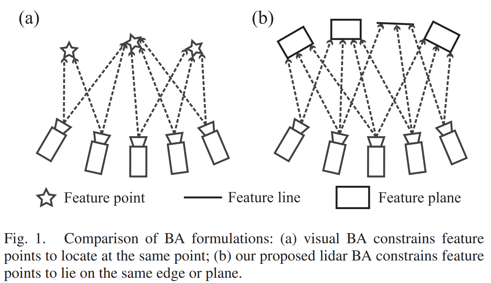
]
.nt-02.pull-right[
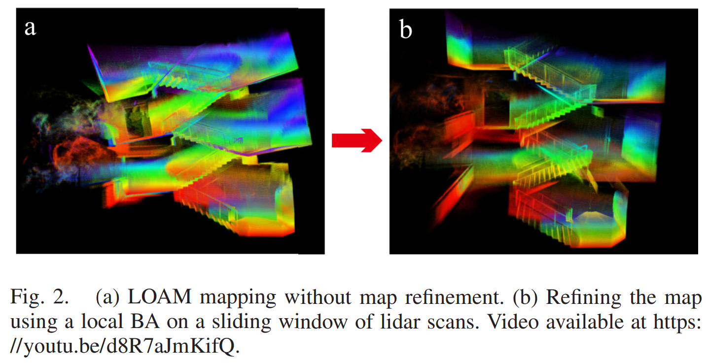
]
.f-90[
- **Visual BA** : 동일한 feature point에 대한 다중 관측 제약
  
- **Sparse LiDAR**에선 point-to-point BA보다, point-to-plane/line BA 
  
- **LiDAR BA in BALM** : faeture points가 동일한 planar/edge위 존재하도록 함
]
---
## BA Formulation
.nt-02.center[
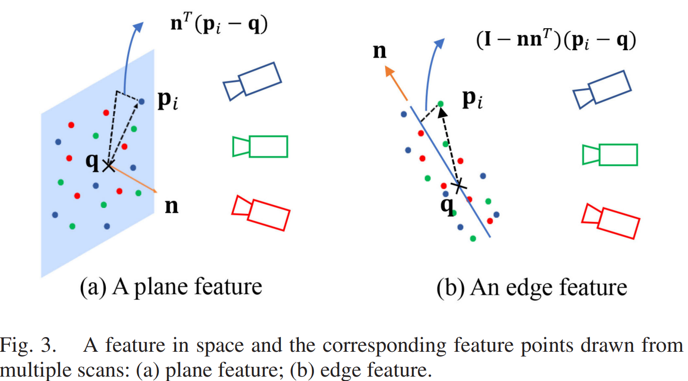
]
.f-80[
  - M개의 스캔으로부터 얻어졌지만 모두 같은 feature(planar/edge)에 해당되는 sparse feature points $p_{fi}$그룹
    - $\mathbf{T}_j = (\mathbf{R}_j, \mathbf{t}_j) \in SO(3) \times \mathbb{R}^3$, $j=(1,...,M)$ 
    - $p_i$: global frame의 feature point 
]

$$\mathbf{p}_i = R_{s_i} \mathbf{p}_{f_i} + \mathbf{t}_{s_i} ; i = 1, \ldots, N.$$
---
## BA Formulation
.nt-02.f-90[
- mean, covariance 정의

$$\bar{\mathbf{p}} = \frac{1}{N} \sum_{i=1}^{N} \mathbf{p}_i; A = \frac{1}{N} \sum_{i=1}^{N} (\mathbf{p}_i - \bar{\mathbf{p}})(\mathbf{p}_i - \bar{\mathbf{p}})^T$$

- Local BA 문제 정의(Planar)]
.f-95[
$$\begin{align*}
(\mathbf{T}^*, \mathbf{n}^*, \mathbf{q}^*) &= \arg \min_{T,n,q} \frac{1}{N} \sum_{i=1}^N (\mathbf{n}^T (\mathbf{p}_i - \mathbf{q}))^2 \\
&= \arg \min_{T} \left( \underbrace{\min_{n,q} \frac{1}{N} \sum_{i=1}^N (\mathbf{n}^T (\mathbf{p}_i - \mathbf{q}))^2}_{=\lambda_3(\mathbf{A}); \text{ if } \mathbf{n}^*=\mathbf{u}_3, \mathbf{q}^*=\bar{\mathbf{p}}} \right)
\end{align*}$$
]
.f-90[
- planar feature의 **최적 파라미터 (n,q)를 closed-form**으로 구해 **pose-only BA** 문제로 변환 
]
???
u3는 covariance A의 세번째 eigenvector, 즉 가장 작은 eigenvalue에 대응하는 벡터
planar feature에서는 평면법선방향, 점들이 가장 덜 퍼지는 방향
밑에 if는 최소값을 달성하는 최적값이 저것들임!
이거 증명방법은 [pi-q = (pi-p바) + (p바-q)]로 대입해서 풀면 결국에는 n^TAn으로 나옴.
planar에서 lamda3인 이유는 평면 법선 분산 방향이 가장 작아야 하기 때문임. 그래서 가장 작은 eigenvalue에 대응하는 eigenvector가 법선벡터가 되는 것임.
즉, 평면 안 두 방향의 분산은 커도됨. 근데 수직한 방향은 작아야함.
**plane은 2차원 구조이므로 한방향만 얇아야함. 그 얇은 방향이 법선방향이기 때문에 분산이 가장작은 고유값이어서 lamda3가 cost가 됨**
---
## BA Formulation
.nt-02.f-90[
- Local BA 문제 정의(Edge)
]
.f-95[
$$\begin{align*}
(\mathbf{T}^{*}, \mathbf{n}^{*}, \mathbf{q}^{*}) &= \underset{\mathbf{T}, \mathbf{n}, \mathbf{q}}{\arg \min} \frac{1}{N} \sum_{i=1}^{N} \left\|\left(\mathbf{I} - \mathbf{n n}^{T}\right)\left(\mathbf{p}_{i} - \mathbf{q}\right)\right\|_{2}^{2} \\
&= \underset{\mathbf{T}}{\arg \min} \underbrace{\left(\underset{\mathbf{n}, \mathbf{q}}{\min} \frac{1}{N} \sum_{i=1}^{N} \left\|\left(\mathbf{I} - \mathbf{n n}^{T}\right)\left(\mathbf{p}_{i} - \mathbf{q}\right)\right\|_{2}^{2}\right)}_{=\text{Tr}(\mathbf{A})-\lambda_{1}(\mathbf{A})=\lambda_{2}(\mathbf{A})+\lambda_{3}(\mathbf{A}); \text{ if } \mathbf{n}^{*}=\mathbf{u}_{1}, \mathbf{q}^{*}=\overline{\mathbf{p}}}
\end{align*}$$
- edge feature의 **최적 파라미터 (n,q)를 closed-form**으로 구해 **pose-only BA** 문제로 변환 
]

.f-90[
- 최적화 대상은 voxel하나의 egienvalue cost
$$\lambda_k(\mathbf{p}(\mathbf{T}))$$
  - $\mathbf{T}$에 대해, $\mathbf{p} = \left[ \mathbf{p}_1^T \ \cdots \ \mathbf{p}_N^T \right]^T$는 동일한 feautre point의 벡터
]
???
이거도 증명과정 planar랑 똑같이 [pi-q = (pi-p바) + (p바-q)]로 대입해서 풀면 결국에는 Tr(A) - lambda1이 나옴
(I-nn^T) : n에 수직한 평면의 projection
(I-nn^T)(pi-q) : 점 pi가 pi-q 벡터에서 얼머나 옆으로 벗어났는가?
norm제곱으로 점에서 직선까지의 제곱거리 => 점들이 어떤 한 edge line에 최대한 가깝에 하자! 
edge에서는 line방향 분산 lamda1는 커도됨. 근데 나머지 두 수직방향 2,3는 작아야함 그래서 Tr(A) - lambda1이 최소가 되는 지점이 최적점이 되는 것임.
**edge는 1차원 구조이므로 한방향만 길고, 나머지는 얆아야함 그래서 큰 방향 lamda1는 남기고 수직방향 lambda2+lambda3가 cost가 됨**
---
## BA Formulation
.nt-02.f-90[
- 점 $\mathbf{p}_i$에 대한 고유값 $\lambda_k$가 얼마나 변하는지, 1차미분 **Gradient**
  - planar voxel이면 $\lambda_3$, edge voxel이면 $\lambda_2 + \lambda_3$
  - 개별 $\lambda_k$에 대한 미분 공식]

$$
\frac{\partial \lambda_k}{\partial \mathbf{p}_i}
= \frac{2}{N} (\mathbf{p}_i - \bar{\mathbf{p}})^T \mathbf{u}_k \mathbf{u}_k^T
$$

.f-90[
- **Gradient**를 점 $\mathbf{p}_j$에 대해 미분한, 2차미분 **Hessian**
  - $i=j$일경우 같은점 $\mathbf{p}_i$를 두번 미분. self-curvature
  - $i\neq j$일경우 서로 다른점 $\mathbf{p}_i, \mathbf{p}_j$ 사이의 교차 미분. cross-coupling
]

$$
\frac{\partial^2 \lambda_k}{\partial \mathbf{p}_j \partial \mathbf{p}_i}
=
\begin{cases}
\frac{2}{N}
\left(
\frac{N-1}{N}\mathbf{u}_k \mathbf{u}_k^T
+
\mathbf{u}_k (\mathbf{p}_i-\bar{\mathbf{p}})^T \mathbf{UF}_k^{p_j}
+
\mathbf{UF}_k^{p_j}\mathbf{u}_k^T(\mathbf{p}_i-\bar{\mathbf{p}})
\right),
& i=j, \\[1ex]
\frac{2}{N}
\left(
-\frac{1}{N}\mathbf{u}_k \mathbf{u}_k^T
+
\mathbf{u}_k (\mathbf{p}_i-\bar{\mathbf{p}})^T \mathbf{UF}_k^{p_j}
+
\mathbf{UF}_k^{p_j}\mathbf{u}_k^T(\mathbf{p}_i-\bar{\mathbf{p}})
\right),
& i\neq j.
\end{cases}
$$
???
Gradient수식은 점 pi가 uk방향으로 평균에서 벗어나 있을수록 그 점은 $lambda_k$에 더 큰 영향을 미친다는 것을 보여줌
즉, voxel의 eigenvalue는 voxel내 점들의 uk방향으로의 퍼짐 정도에 민감하게 반응함

Hessian에서 i=j인 경우 내 점을 움직이면 내점도 변하고 평균도 같이 변함
i=/j인 경우 다른점을 움직이면 내 점은 안변하고 평균만 변함
첫번째항은 점-평균구조에 생김. 같은점 미분시 자기자신 영향 큼 / 다른점 미분시 평균통해서간 간점영향 부호가 음수
두번째항은 고유벡터 uk가 바뀌는항.
세번째항은 고유벡터 변화항
1. 평균점의 직접변화
2. eigenvector 변화 / eigenvector 변화의 대칭짝
---
## BA Formulation
.nt-02.f-90[
  - 점 $\mathbf{p}_i$를 움직였을때 고유벡터 $\mathbf{u}_k$의 변화
    - $\mathbf{F}_{k}^{\mathbf{P}_{j}}$는 $\mathbf{p}_j$에 대한 $\mathbf{u}_k$의 변화량을 나타내는 3x3 행렬. 즉 **eignevector senstivity**
]

$$\mathbf{F}_{k}^{\mathbf{P}_{j}} = \begin{bmatrix}
\mathbf{F}_{1,k}^{\mathbf{P}_{j}} \\
\mathbf{F}_{2,k}^{\mathbf{P}_{j}} \\
\mathbf{F}_{3,k}^{\mathbf{P}_{j}}
\end{bmatrix} \in \mathbb{R}^{3 \times 3}, \quad \mathbf{U} = [\mathbf{u}_1 \ \mathbf{u}_2 \ \mathbf{u}_3]$$

.f-90[
  - $\mathbf{F}_{m,n}^{\mathbf{p}_j}$는 고유벡터들 사이의 coupling 합
    - $m\neq n$인 경우, 서로 다른 eigendirection 사이의 coupling
    - $m=n$인 경우, 자기자신의 변화는 고유벡터 변화에 영향 없음
]

$$\mathbf{F}_{m,n}^{\mathbf{p}_j} = \begin{cases}
\frac{(\mathbf{p}_j - \bar{\mathbf{p}})^T}{N(\lambda_n - \lambda_m)}(\mathbf{u}_m \mathbf{u}_n^T + \mathbf{u}_n \mathbf{u}_m^T), & m \neq n \\
\mathbf{0}_{1 \times 3}, & m = n
\end{cases}$$

???
-$\mathbf{F}_{m,n}^{\mathbf{p}_j}$
(pj-pbar)는 pj가 평균에서 얼마나 떨어졌는지
(um um^T + un um^T)는 고유벡터 변화가 다른 고유벡터 방향으로 섞이는 회전
N(lambda_n - lambda_m)는 고유값 차이로, 차이작 작으면 민감하게 / 차이가 크면 안정적
---
## BA Formulation
.nt-02.f-75[
  - voxel 하나의 egienvalue cost에 대한 2차식 근사
$$\lambda_k(\mathbf{p} + \boldsymbol{\delta p}) \approx \lambda_k(\mathbf{p}) + \mathbf{J}(\mathbf{p})\boldsymbol{\delta p} + \frac{1}{2}\boldsymbol{\delta p}^T \mathbf{H}(\mathbf{p})\boldsymbol{\delta p}$$
- scan에서 feature point가 global frame에서의 움직임
$$\mathbf{p}_i = \mathbf{R}_{s_i} \exp(\phi_{s_i}^\wedge) \mathbf{p}_{f_i} + \mathbf{t}_{s_i}; \frac{\delta \mathbf{p}_i}{\delta \mathbf{T}_{s_i}} = \left[ -\mathbf{R}_{s_i} (\mathbf{p}_{f_i})^\wedge \quad \mathbf{I} \right]$$
- voxel 하나의 egienvalue cost를 pose incremenst $\delta \mathbf{T}$에 대한 2차식으로 근사
$$\lambda_k(\mathbf{T} \boxplus \delta\mathbf{T}) \approx \lambda_k(\mathbf{T}) + \underbrace{\mathbf{JD}}_{\bar{\mathbf{J}}} \delta\mathbf{T} + \frac{1}{2} \delta\mathbf{T}^T \underbrace{\mathbf{D}^T \mathbf{HD}}_{\bar{\mathbf{H}}} \delta\mathbf{T}$$
- Levenberg-Marquardt 업데이트 공식
$$(\bar{\mathbf{H}}(T) + \mu \mathbf{I})\delta \mathbf{T}^* = -\bar{\mathbf{J}}(T)^T$$
]
???
첫번째식 : point 기준 2차 근사. voxel cost 람다를 point-space에서2차 근사
두번째식 : point와 pose의 관계식. pose perturbation이 point를 어떻게 움직이는지
세번째식 : 핵심. 실제 최적화 변수인 pose로 바꾼 결과.즉 pose기준 2차 근사. point-space quadratic을 pose-space quadratic으로 변경
네번째식 : Levenberg-Marquardt 업데이트 공식
---
## Adaptive Voxelization
.nt-02.pull-left[
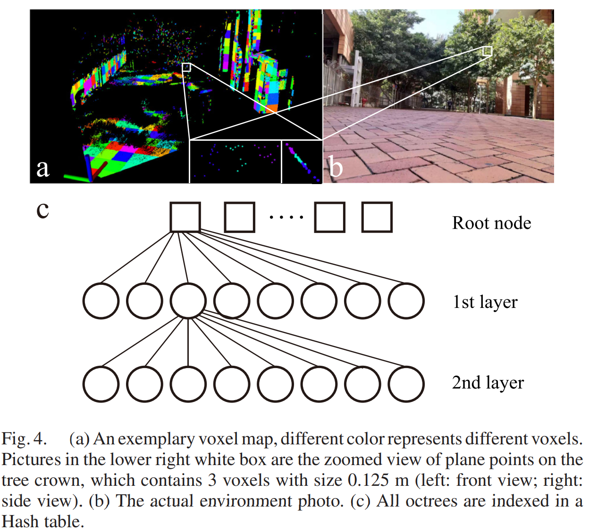
]

.pull-right-53.f-80[
  - Rough pose를 이용해 multi-scan fature points를 정렬
- 3D 공간을 voxel 단위로 분할
  
- 각 voxel 내부 점군의 covariance eigenvaluse로 planar/edge 구조 판별
  
- 하나의 feature로 보기 어려운 voxel은 세분화
  
- 각 voxel을 하나의 geometirc feature 및 cost item으로 활용  
]
???
(a),(b)는 실제실험사진
---
## Adative Voxelization
.nt-02.f-90[
- **Remak1**
  - voxel안 점이 너무 많으면 Hessian 차원이 커지므로, **같은 scan에서 온 점들을 평균화해도 된다**
  - raw feature point가 정의한 same plane위에 있으면, 계산을 줄이면서 consistency는 유지함

- **Remark2**
  - Hessian은 $\lambda_i \neq \lambda_k$를 필요하므로 수치적으로 불안정한 voxel은 BA에서 제외

- **Remak3**
  - voxel을 세밀하게 만들고 **same plane** 검사 허용 오차를 기우면 curved surface같은 것도 대응 가능

- **Remark4**
  - recursive subdivision은 **max depth**와 **minimum number of points** 조건으로 멈춤
]
---
## LOAM with Local BA
.nt-02.pull-left-50[
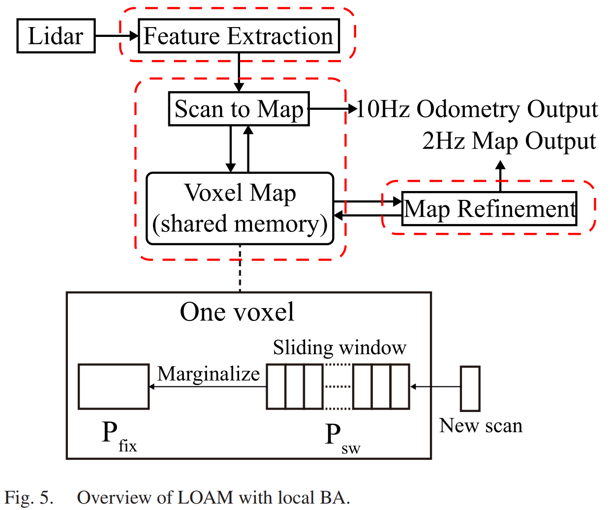
]
.nt-07.pull-right-50.f-80[
- **Feature Extratcion** 
  - Raw point에서 edge/planar feature point 추출
  
- **Odometry (Rough Pose Estimation)**
  - 새 scan을 기존 map 정합하여 rough pose 추정

- **Adaptive Voxelization/Voxel Map Update**
  - 정렬된 faeture point를 **edge/planar voxel map** 생성
  - eigenvalue 기반 검사과 8-octant를 이용해 feature corresopondence 생성
  
- **Map Refinement (Local BA)**
  - sliding window $\mathbf{P}_{sw}$안의 voxel들을 통해 eigenvalue기반 cost 생성
  - pose-only BA로 pose 업데이트
  
- **Marginalization**
  - 오래된 정보는 $\mathbf{P}_{fix}$로 요약된 형태로 보존  
  ]
???
feature extraction으로 sparse feature를 만들고 → 
odometry가 rough pose를 구해 새 scan을 voxel map에 넣고 → 
adaptive voxelization이 correspondence를 만들고 → 
map-refinement가 sliding window local BA로 pose를 다시 고치고 → 
오래된 정보는 Pfix로 요약 보존하는 구조
---
## LOAM with Local BA
.nt-02.f-90[
- **Feature extraction** : raw point에서 edge/planar feature point 추출
  
- **Odometry** : 새로운 scan의 initail pose estimation
  
- **Global alignment** : odometry pose를 통해서 feature point을 global map frame으로 정렬
  
  $$\mathbf{p}_i = R_{s_i} \mathbf{p}_{f_i} + \mathbf{t}_{s_i} ; i = 1, \ldots, N.$$
- **Adaptive Voxelization** : edge/planar Voxel map에 feature point를 삽입하고 Adative subdivision 수행
  
- **Local BA** : voxel의 mean/covariance를 통해 eigenvalue 기반 cost로 local BA 수행
  
- **Update** : pose와 Voxel 업데이트, 오래된 점은 marginalize
]
---
## Experimental
.nt-02.f-90[
- **Use LiDAR Livox Horizon**]
.nt-02.pull-left-50[
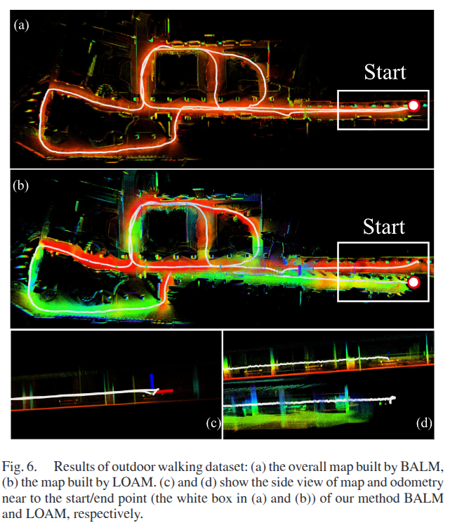
]
.nt-02.pull-right-50[
  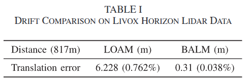
]
---
## Experimental
.nt-02.f-90[
  - **Use LiDAR Livox Mid40**]
.center[
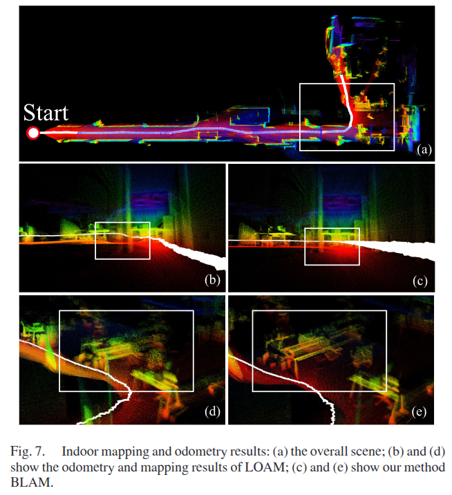
]
---
## Experimental
.nt-02.f-90[
  - **Use LiDAR Velodyne VLP-16**]
.nt-02.pull-left-50[
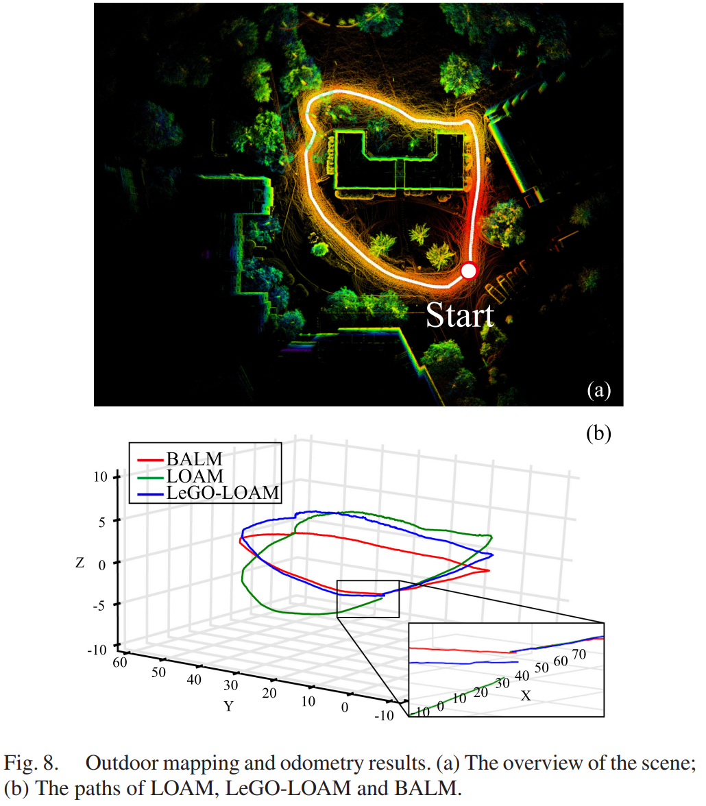
]
.nt-02.pull-right-50[
  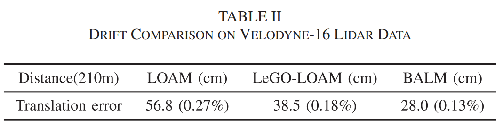
]
---
## Experimental
.center[
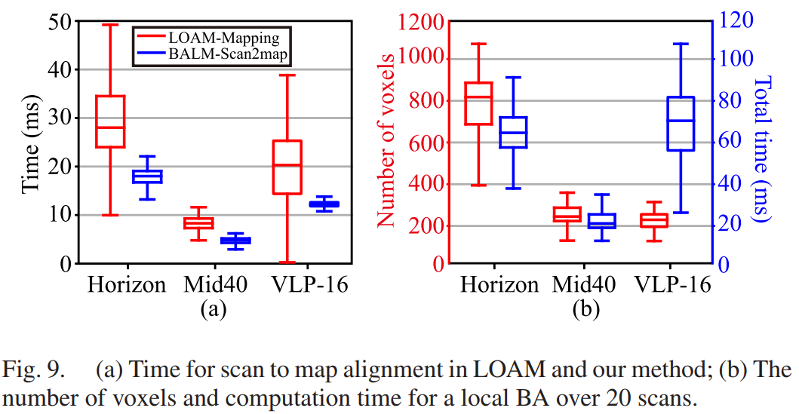
]
- BALM은 drift를 줄이고, 실행시간도 실용적임을 보여줌
- local BA와 voxel update를 적용한 BALM이 대부분 빠르게 완료됨
---
## Conclusion
.nt-02.f-90[
- **Closed form feature elimination기반 LiDAR BA Formulation**
  - planar/edge feature의 최적 파라미터를 closed-form으로 구해서 pose-only BA 문제로 변환
  
- **Gradient/Hessian 기반 second-order optimization**
  - eigenvalue cost에 대한 gradient/hessian을 closed-form으로 유도
  
- **Adaptive Voxelization기반 효율적인 edge/planar correspondence**
  - 같은 edge/planar에 속하는 feature points를 하나의 voxel로 묶어서 local BA에 활용
]