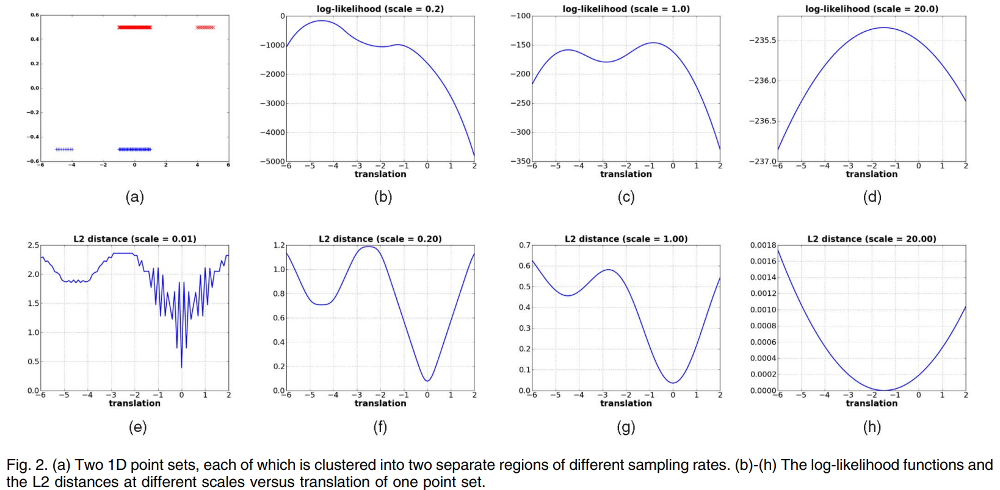
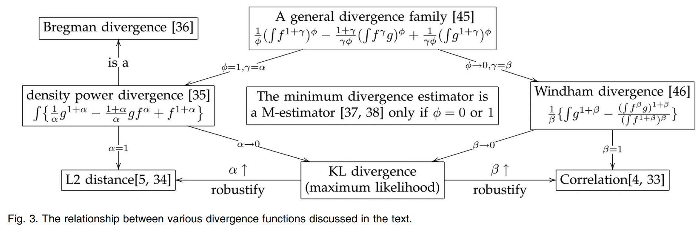
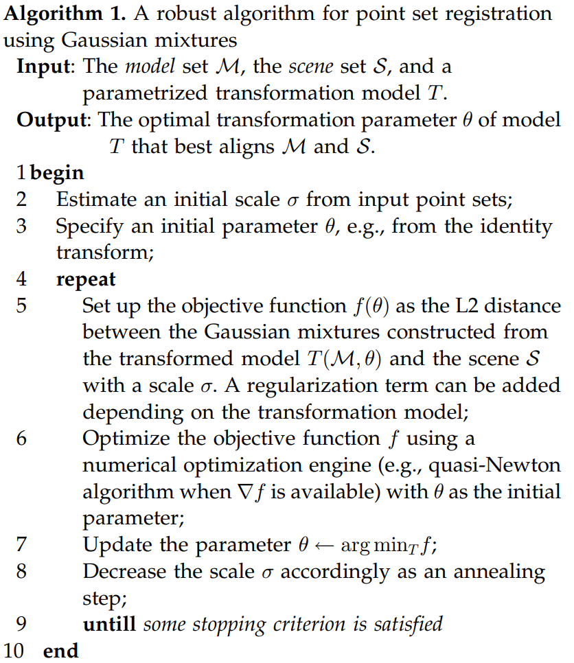

# Introduction
  - point set을 **Gaussian Mixture Model**로 표현해 robust하게 registration하는 방법제안
  
  - Registration 문제를 **2개의 Gaussian Mixture Model의 alignment 문제로 재정의**
  
  - **closed-form L2 distance**를 사용해 robust하고 계산 가능한 framwork 제안
  
???

---
## Point Set as Gaussian Mixture Model
.nt-02.nb-01.f-90[
- **Point set을 point list가 아닌 Gaussian Mixture density로 표현**

- 일반적인 GMM 
$$p(\mathbf{x}) = \sum_{i=1}^k w_i \phi(\mathbf{x}|\mu_i, \Sigma_i)$$
$$\phi(\mathbf{x}|\mu_i, \Sigma_i) = \frac{\exp\left[-\frac{1}{2}(\mathbf{x} - \mu_i)^T \Sigma_i^{-1}(\mathbf{x} - \mu_i)\right]}{\sqrt{(2\pi)^d |\det(\Sigma_i)|}}$$
  - $k$ : componet의 수(점 개수)
  - $\mu_i$ : component의 mean (점 위치)
  - $\Sigma_i$ : component의 covariance (점 분포)
  - $w_i$ : component의 weight (점 중요도) 
]
???
point cloud를 Gaussian Mixture density로 표현.
각 점에 Gaussian을 얹고 spherical covariance를 공유하는 단순한 구조 사용량

---
## Registration as Density Alignment
.nt-02.nb-01[
  - Objective function
$$d_{L_2}(S, \mathcal{M}, \theta) = \int (gmm(S) - gmm(T(\mathcal{M}, \theta)))^2 dx$$
.f-90[
- $S$: fixed scene / target point set
- $\mathcal{M}$: moving model / source point set
- $\theta$: transformation parameters
- $T(\mathcal{M}, \theta)$: transformed model set
]

- Registration을 point residual minimization이 아니라 density discrepancy minimization으로 바꾼다
]
???
point-to-point residual을 최소화가 아님. 
registration단위를 point residual에서 density discrepancy로 함
---
## L2 Distance(Robust + Closed form)
.center[

]
- outlier / density 불균형 상황에서 L2와 Log-likelihood에서 더 안정적임
---
## L2 Distance(Robust + Closed form)
.nt-02.nb-01.f-90[
- density power divergence
$$d_\alpha(g, f) = \int \left\{ \frac{1}{\alpha}g^{1+\alpha} - \frac{1+\alpha}{\alpha}gf^\alpha + f^{1+\alpha} \right\} dx$$
  - $\alpha$ : 0이면 KL divergence, 1이면 L2 distance 
- Gaussian Product Integral
$$\int \phi(\mathbf{x}|\mu_1, \Sigma_1)\phi(\mathbf{x}|\mu_2, \Sigma_2)\,dx = \phi(0|\mu_1 - \mu_2, \Sigma_1 + \Sigma_2)$$

  - Gaussian mixture 사이의 L2 distance가 실제로 계산 가능한 objective function이 됨
]
???
알파가 0으로 수렴하면 KL divergence, 1로 수렴하면 L2 distance가 됨
L2를 고른 이유 2가지. robust함이고,
Gaussian product integral을 이용해 Gaussian mixture 사이의 L2 distance가 실제로 계산 가능한 objective function이 됨
---
## Unified Interpretation
.center[

]
.f-90[
- ICP → approximate KL
- EM / MLE → likelihood / KL
- KC → correlation / L2 cross-term
- Proposed → L2 distance between Gaussian mixtures
]
???
ICP, EM,/MLE 계열, kernel correlation 별개 알고리즘이 아닌 divergence 관점에서 다시 배치
가운데 KL divergence가 있고, 왼쪽은 density power divergence를 따라 L2 distance로,
오른쪽은 Windham divergence를 따라 correlation으로 연결 
fig3에서 자기 방법을 L2 distance between Gaussian mixtures로 위치
---
## Practical Algorithms
.pull-left[
.f-90[
- **Rigid registration**
  - translation은 closed-form update
  - rotation은 gradient-based optimization

- **Non-rigid registration**
  - smooth deformation field 최적화
  - regularization으로 motion coherence 유지
]

.f-90[
$$
\begin{aligned}
\frac{\partial F}{\partial t} &= \mathbf{G}^T \mathbf{1}_m \\
\frac{\partial F}{\partial r_i} &= \mathbf{1}_d^T
\left(
(\mathbf{G}^T \mathbf{M}_0)\otimes\frac{\partial \mathbf{R}}{\partial r_i}
\right)\mathbf{1}_d
\end{aligned}
$$
]
]

.pull-right[
.center[

]
]
---
## Constraint / Limitation
.nt-02.nb-01.f-90[
### Constraints
- Density-based registration이므로 sampling density가 비슷한 두 point set에서 더 유리함
- GMM construction은 equal weights, point-centered means, shared spherical covariance를 가정
- 입력은 mesh, label, descriptor 없이 point coordinates만 있는 unstructured point set가 전제
]

.f-90.mt-02[
### Limitations
- L2 objective가 robust하더라도 local minima는 여전히 남음
- symmetry, repeated patterns, large motion, poor initialization에서는 optimization이 local minimum에 갇힐 수 있음
- 실제 성능은 large-scale start, annealing, multiple starts, coarse-to-fine 같은 heuristic에 크게 의존함
- 모든 registration 문제에서 항상 최선의 방법이라고 보기는 어려움
]
---
## Conclusion
.f-90[
- Point set registration을 **Gaussian mixture alignment** 문제로 재정의

- **closed-form L2 distance** 기반 objective로 robust하고 계산 가능한 정합 수행

- ICP, EM/MLE, kernel correlation을 **하나의 divergence framework**에서 통합적으로 해석
]