```{r xaringanExtra, echo=FALSE}
xaringanExtra::use_xaringan_extra(c("tile_view", "animate_css", "tachyons", "scribble", "freezeframe"))
```


class: inverse, middle, center, title-slide, animated plus
# 🤔 생각해 보기

---
# 다음에 나올 수는?

.middle-25[
.Huge[$$0, 2, 4, 6, 8, ?\;\;$$]
]

???
초등학교때나 IQ 검사할때 나오는 질문

---
# 다음에 나올 수는?

.middle-25[
.Huge[$$0, 2, 4, 6, 8, \color{red}{10}$$]
]


---
# 다음에 나올 수는?

.middle-25[
.Huge[$$0, 2, 4, 6, 8, 10$$]
]


.middle-40[
.Huge[$$1, 3, 5, 7, 9, ?\;\;$$]
]

---
# 다음에 나올 수는?

.middle-25[
.Huge[$$0, 2, 4, 6, 8, 10$$]
]


.middle-40[
.Huge[$$1, 3, 5, 7, 9, \color{red}{11}$$]
]

---
# 다음에 나올 수는?

.middle-25[
.Huge[$$0, 2, 4, 6, 8, 10$$]
]


.middle-40[
.Huge[$$1, 3, 5, 7, 9, \color{red}{11}$$]
]

.middle-65[
.center[.Huge[.red[왜?]]]
]

???
우리는 이미 1차 함수에 대해서 알고 있다.

---
# Human Intelligence (인간지능)

.pull-left-60[
.pull-down-2[
.normalsize[
| &nbsp;&nbsp;&nbsp; 입력 &nbsp;&nbsp;&nbsp; | &nbsp;&nbsp;&nbsp; 출력 &nbsp;&nbsp;&nbsp; |
|:----:|:----:|
| $\color{red}{0}$ | $\color{blue}{0}$ |
| $\color{red}{1}$ | $\color{blue}{2}$ |
| $\color{red}{2}$ | $\color{blue}{4}$ |
| $\color{red}{3}$ | $\color{blue}{6}$ |
| $\color{red}{4}$ | $\color{blue}{8}$ |
| $\color{red}{5}$ | $\color{blue}{?}$ |
]
]
]

.pull-right-40[
.pull-up-6[
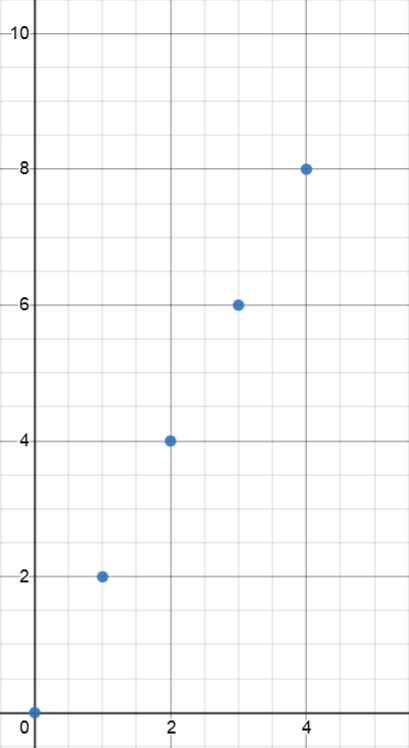
]
]

---
# Human Intelligence (인간지능)

.pull-left-60[
.pull-down-2[
.normalsize[
| &nbsp;&nbsp;&nbsp; 입력 &nbsp;&nbsp;&nbsp; | &nbsp;&nbsp;&nbsp; 출력 &nbsp;&nbsp;&nbsp; |
|:----:|:----:|
| $\color{red}{0}$ | $\color{blue}{0}$ |
| $\color{red}{1}$ | $\color{blue}{2}$ |
| $\color{red}{2}$ | $\color{blue}{4}$ |
| $\color{red}{3}$ | $\color{blue}{6}$ |
| $\color{red}{4}$ | $\color{blue}{8}$ |
| $\color{red}{5}$ | $\color{blue}{10}$ |
]
]
]

.pull-right-40[
.pull-up-6[
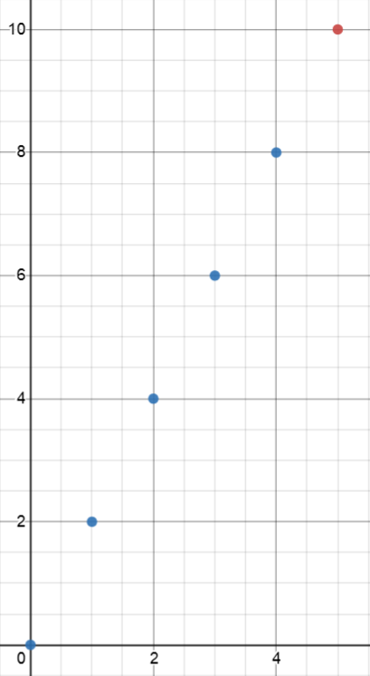
]
]

---
# Human Intelligence (인간지능)

.pull-left-60[
.pull-down-2[
.normalsize[
| &nbsp;&nbsp;&nbsp; 입력 &nbsp;&nbsp;&nbsp; | &nbsp;&nbsp;&nbsp; 출력 &nbsp;&nbsp;&nbsp; |
|:----:|:----:|
| $\color{red}{0}$ | $\color{blue}{0}$ |
| $\color{red}{1}$ | $\color{blue}{2}$ |
| $\color{red}{2}$ | $\color{blue}{4}$ |
| $\color{red}{3}$ | $\color{blue}{6}$ |
| $\color{red}{4}$ | $\color{blue}{8}$ |
| $\color{red}{5}$ | $\color{blue}{10}$ |
]
]
.center[
.large[
$\color{blue}{y} = \color{green}{2}\color{red}{x}$
]
]
]

.pull-right-40[
.pull-up-6[
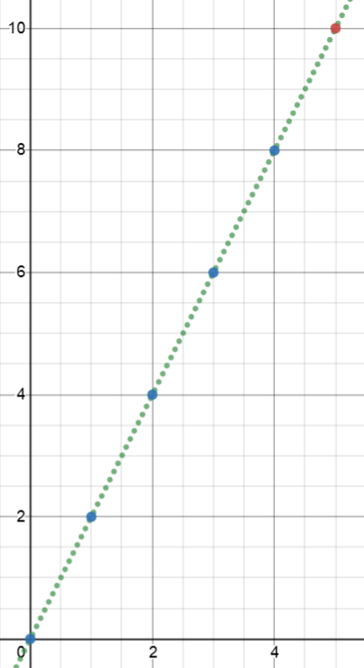
]
]

---
# Human Intelligence (인간지능)

.pull-left-60[
.pull-down-2[
.normalsize[
| &nbsp;&nbsp;&nbsp; 입력 &nbsp;&nbsp;&nbsp; | &nbsp;&nbsp;&nbsp; 출력 &nbsp;&nbsp;&nbsp; |
|:----:|:----:|
| $\color{red}{0}$ | $\color{blue}{1}$ |
| $\color{red}{1}$ | $\color{blue}{3}$ |
| $\color{red}{2}$ | $\color{blue}{5}$ |
| $\color{red}{3}$ | $\color{blue}{7}$ |
| $\color{red}{4}$ | $\color{blue}{9}$ |
| $\color{red}{5}$ | $\color{blue}{11}$ |
]
]
.center[
.large[
$\color{blue}{y} = \color{green}{2}\color{red}{x} + \color{green}{1}$
]
]
]

.pull-right-40[
.pull-up-7[
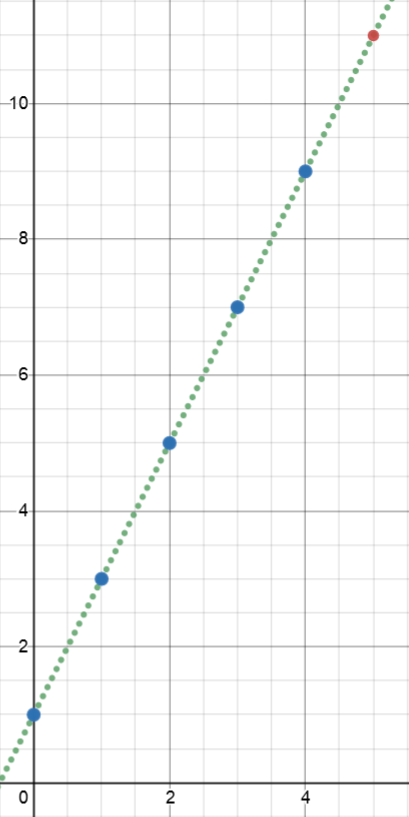
]
]


???
이번 예에서는 0부터 출발하든지 1부터 출발하든지 상관없다.
정해주지 않았으니까

이번 시간에는 이러한 1차 함수에 대해서 알아도록 하겠다.
그전에 잠깐

---
# 다음에 나올 수는?

.middle-25[
.Huge[$$0, 2, 4, 6, 8, 10$$]
]


.middle-40[
.Huge[$$1, 3, 5, 7, 9, 11$$]
]

.middle-55[
.Huge[$$1.1, 2.9, 5.3, 6.8, 9.2, ?\;\;$$]
]


???
비선형일때 fitting하는 법은?

---
# Machine Intelligence (인공지능)

.pull-left-60[
.pull-down-2[
.normalsize[
| &nbsp;&nbsp;&nbsp; 입력 &nbsp;&nbsp;&nbsp; | &nbsp;&nbsp;&nbsp; 출력 &nbsp;&nbsp;&nbsp; |
|:----:|:----:|
| $\color{red}{0}$ | $\color{blue}{1.1}$ |
| $\color{red}{1}$ | $\color{blue}{2.9}$ |
| $\color{red}{2}$ | $\color{blue}{5.3}$ |
| $\color{red}{3}$ | $\color{blue}{6.8}$ |
| $\color{red}{4}$ | $\color{blue}{9.2}$ |
| $\color{red}{5}$ | $\color{blue}{?}$ |
]
]
]

.pull-right-40[
.pull-up-7[
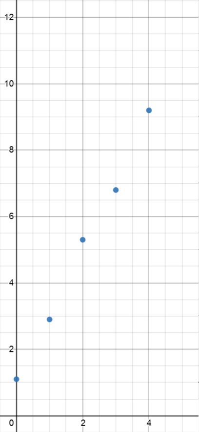
]
]

---
# Machine Intelligence (인공지능)

.pull-left-60[
.pull-down-2[
.normalsize[
| &nbsp;&nbsp;&nbsp; 입력 &nbsp;&nbsp;&nbsp; | &nbsp;&nbsp;&nbsp; 출력 &nbsp;&nbsp;&nbsp; |
|:----:|:----:|
| $\color{red}{0}$ | $\color{blue}{1.1}$ |
| $\color{red}{1}$ | $\color{blue}{2.9}$ |
| $\color{red}{2}$ | $\color{blue}{5.3}$ |
| $\color{red}{3}$ | $\color{blue}{6.8}$ |
| $\color{red}{4}$ | $\color{blue}{9.2}$ |
| $\color{red}{5}$ | $\color{blue}{11.45}$ |
]
]
.center[
.large[
$\color{blue}{y} = \color{green}{2.1}\color{red}{x} + \color{green}{1.04}$
]
]
]

.pull-right-40[
.pull-up-7[
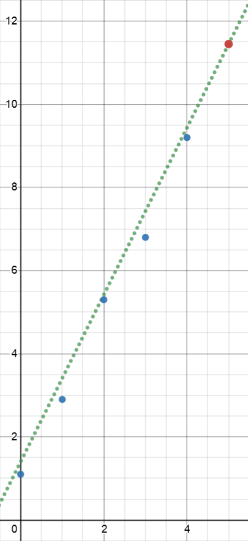
]
]

???
extrapolation(외삽) 뿐만 아니라 interpolation(보간)까지

---
# AI vs. ML vs. DL 

.nt-01.center[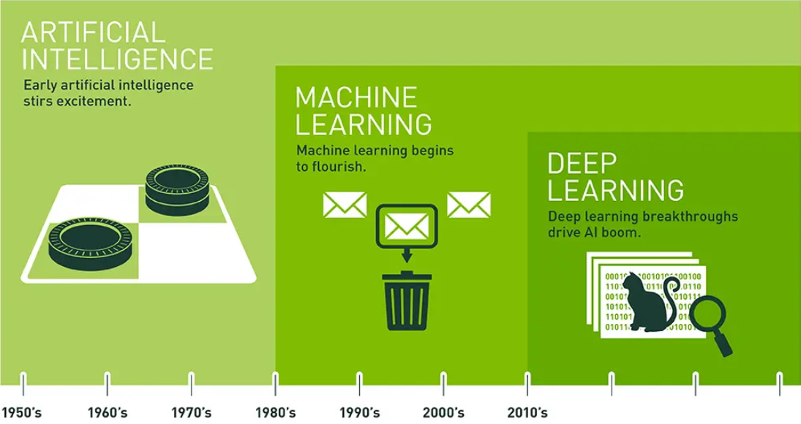]
.footer-right[https://blogs.nvidia.com/blog/2016/07/29/whats-difference-artificial-intelligence-machine-learning-deep-learning-ai/]

---
# Supervised Learning in ML and DL

1. 학습데이터를 만든다. (.red.b[입력값] vs. .blue.b[출력값])
1. 모델을 만든다 (.green.b[파라미터]가 포함된 .b[함수]): 
1. 학습데이터를 이용하여 모델을 학습한다. (파라미터를 최적화한다)
1. 테스트데이터의 입력값을 함수에 넣어 출력값을 구한다.

.pt4.f2[
$$\color{blue}{\mathbf{y}} = \mathbf{f}(\color{red}{\mathbf{x}}; \color{green}{\mathbf{w}})$$
]


---
class: inverse, middle, center, title-slide, animated plus
# 🌡️ 선형회귀
## Linear Regression

---
# 선형회귀 

.nt-02[
.pull-left[
- 1D
.center.pt5[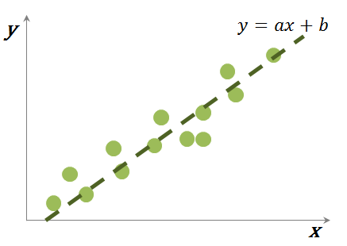]
]

.pull-right[
- 2D
.center[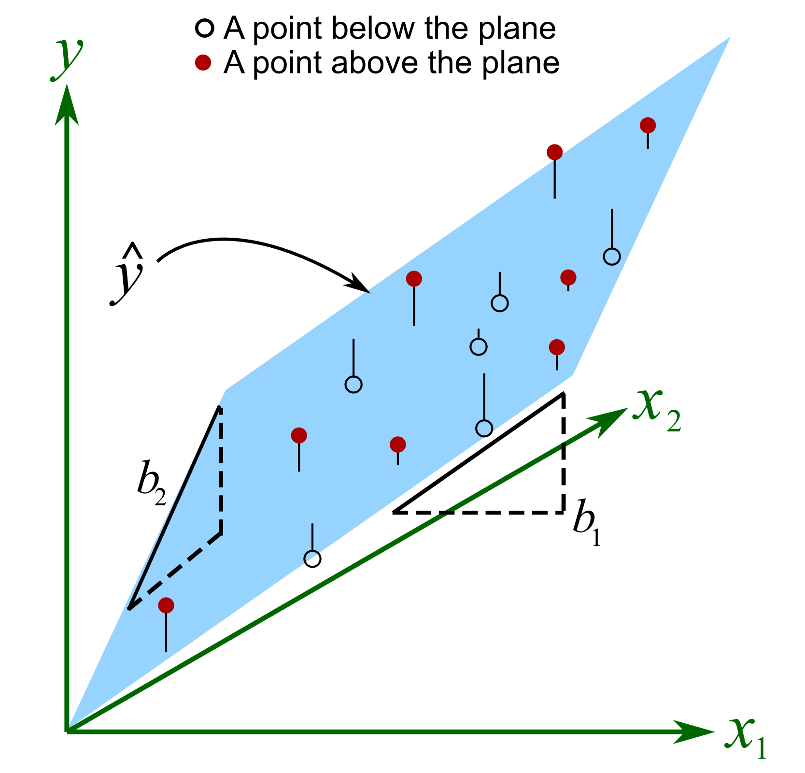]
]
]

---
# 선형회귀의 3가지 풀이법

.content-list.f-130[
1. 의사 역행렬 (Pseudo Inverse)
1. 최소 자승법 (Least Square Errors)
1. 최대 우도 (Maximum Likelihood)
]

---
# ①  의사 역행렬 (Pseudo Inverse)

.nt-01[
1. Data
.font90.nt-01[
$$D = \{(\color{red}{\mathbf{x}_i}, \color{blue}{y_i}) \mid \color{red}{\mathbf{x}_i} \in \mathbb{R}^d, \color{blue}{y} \in \mathbb{R}\}_{i=1}^n \;\;  \;\;\Rightarrow\;\; \color{red}{\mathbf{X}} \in \mathbb{R}^{n\times (d+1)}, \:\color{blue}{\mathbf{y}} \in \mathbb{R}^n$$
]
1. Model
.font90.nt-02[
$$\color{blue}{y} = \color{green}{\mathbf{w}}^\top\color{red}{\tilde{\mathbf{x}}}$$
]
1. System of Equations
.font90.nt-01[
$$\color{blue}{\mathbf{y}} = \color{red}{\mathbf{X}}\color{green}{\mathbf{w}}$$
]
1. Normal Equation
.font90.nt-01[
$$\color{red}{\mathbf{X}}^\top\color{red}{\mathbf{X}}\color{green}{\mathbf{w}} = \color{red}{\mathbf{X}}^\top\color{blue}{\mathbf{y}}$$
]
1. Pseudo Inverse
.font90.nt-01[
$$\color{green}{\mathbf{w}} = (\color{red}{\mathbf{X}}^\top\color{red}{\mathbf{X}})^{-1}\color{red}{\mathbf{X}}^\top\color{blue}{\mathbf{y}}$$
]
]

---
# ② 최소 자승법 (Least Square Errors)

.nt-01[
1. Data
.font90.nt-01[
$$D = \{(\color{red}{\mathbf{x}_i}, \color{blue}{y_i}) \mid \color{red}{\mathbf{x}_i} \in \mathbb{R}^d, \color{blue}{y} \in \mathbb{R}\}_{i=1}^n \;\;  \;\;\Rightarrow\;\; \color{red}{\mathbf{X}} \in \mathbb{R}^{n\times (d+1)}, \:\color{blue}{\mathbf{y}} \in \mathbb{R}^n$$
]
1. Model
.font90.nt-02[
$$\color{blue}{y} = \color{green}{\mathbf{w}}^\top\color{red}{\tilde{\mathbf{x}}}$$
]
1. Error
.font90.nt-01[
$$\color{orange}{e} = \left(\color{red}{\mathbf{X}}\color{green}{\mathbf{w}}-\color{blue}{\mathbf{y}}\right)^\top\left(\color{red}{\mathbf{X}}\color{green}{\mathbf{w}}- \color{blue}{\mathbf{y}}\right)$$
]
1. Partial Derivative
.font90.nt-01[
$$\frac{\partial \color{orange}{e}}{\partial \color{green}{\mathbf{w}}}=0 \;\;\Rightarrow\;\; \color{red}{\mathbf{X}}^\top\color{red}{\mathbf{X}}\color{green}{\mathbf{w}} = \color{red}{\mathbf{X}}^\top\color{blue}{\mathbf{y}}$$
]
1. Optimal Solution
.font90.nt-02[
$$\color{green}{\mathbf{w}} = (\color{red}{\mathbf{X}}^\top\color{red}{\mathbf{X}})^{-1}\color{red}{\mathbf{X}}^\top\color{blue}{\mathbf{y}}$$
]
]

---
# ③ 최대 우도 (Maximum Likelihood)

.nt-01[
1. Data
.font90.nt-01[
$$D = \{(\color{red}{\mathbf{x}_i}, \color{blue}{y_i}) \mid \color{red}{\mathbf{x}_i} \in \mathbb{R}^d, \color{blue}{y} \in \mathbb{R}\}_{i=1}^n \;\;  \;\;\Rightarrow\;\; \color{red}{\mathbf{X}} \in \mathbb{R}^{n\times (d+1)}, \:\color{blue}{\mathbf{y}} \in \mathbb{R}^n$$
]
1. Model
.font90.nt-02[
$$\color{blue}{y} = \color{green}{\mathbf{w}}^\top\color{red}{\tilde{\mathbf{x}}} + \color{orange}{\epsilon}, \;\; \color{orange}{\epsilon} \sim \mathcal{N}(0, \color{orange}{\sigma^2})$$
]
1. Likelihood
.font90.nt-02[
$$p(\color{blue}{\mathbf{y}} | \color{red}{\mathbf{X}}, \color{green}{\mathbf{w}}) = \prod_{i=1}^n \mathcal{N}(\color{blue}{y_i} | \color{green}{\mathbf{w}}^\top\color{red}{\tilde{\mathbf{x}}_i}, \color{orange}{\sigma^2})= \mathcal{N}\left(\color{blue}{\mathbf{y}} | \color{red}{\mathbf{X}}\color{green}{\mathbf{w}}, \color{orange}{\sigma^2}\mathbf{I}\right)$$
]
1. Maximum Likelihood
.font90.nt-02[
$$\frac{\partial}{\partial \color{green}{\mathbf{w}}}\left(-\log P\right)=0 \;\;\Rightarrow\;\; \color{red}{\mathbf{X}}^\top\color{red}{\mathbf{X}}\color{green}{\mathbf{w}} = \color{red}{\mathbf{X}}^\top\color{blue}{\mathbf{y}}$$
]
1. Optimal Solution
.font90.nt-02[
$$\color{green}{\mathbf{w}} = (\color{red}{\mathbf{X}}^\top\color{red}{\mathbf{X}})^{-1}\color{red}{\mathbf{X}}^\top\color{blue}{\mathbf{y}}$$
]
]

---
# 선형회귀의 3가지 확장

.center.nt-01[
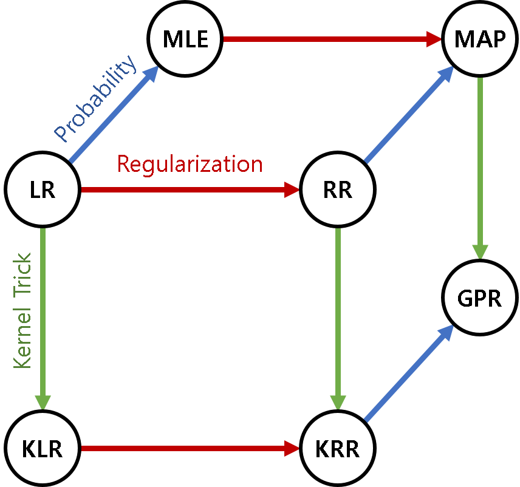
]

.footer[
- Soohwan Kim, "GPmaps: A Bayesian Nonparametric Approach for Mapping and Reconstruction," PhD Thesis, 2015.
]

---
# 선형회귀의 3가지 풀이 및 확장

.center[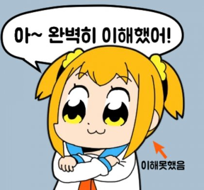]

.footer-right[http://m.ppomppu.co.kr/new/bbs_view.php?id=help&no=1257492]

---
# 선형회귀의 3가지 풀이 및 확장

.center[]

.footer-right[https://giphy.com/gifs/afterthis-oleeee-3oFyDoJts3s3rIb6O4]

---
# Big Picture

.pull-left[
1. Linear Algebra
   1. $\color{red}{\mathbf{A}}\color{green}{\mathbf{x}} = \color{blue}{\mathbf{b}}$
   1. $\mathbf{A}\mathbf{x} = \mathbf{0}$
1. Calculus
   1. Derivatives
   1. Least Squares
   1. Matrix Calculus
1. Probability
   1. Bayes' Theorem
   1. Gaussian Distribution
   1. Entropy
   1. Maximum Likelihood (MLE)
   1. Maximum a Posteriori (MAP)
]

.pull-right[
1. Linear Models for Regression
   1. Linear Regression
   1. Regularization
   1. Basis Functions
   1. Kernel Trick
   1. Bayesian Linear Regression
   1. Gaussian Processes
   1. Logistic Regression
1. Linear Models for Classification
   1. Logistic Regression
1. Multilayer Perceptron
]


???
? What We'll Learn
.pull-right.nt-02.f-90[
1. Linear Algebra and Geometry
   1. Rank
   1. Gaussian Elimination
   1. Dot Product, Projection Matrix
   1. 4 Fundamental Spaces
   1. Egenvalues and Eigenvectors
   1. Singular Value Decomposition
1. Calculus
   1. Quadratic Functions
   1. Taylor Series
   1. Gradient, Jacobian, Hessian
   1. Matrix Calculus
1. Probability and Statistics
   1. Covariance, Correlation
   1. Gaussian Distributions
   1. Maximum Likelihood
   1. Bias vs. Variance
   1. Maximum a Posteriori
   1. Bayesian Approach
]
]

???
1. Mixture Models
   1. Expectation Maximization
   1. Variational Inference
   1. Expectation Propagation

???
?  Big Picture

.pull-left[
1. Linear Algebra
   1. $\mathbf{A}\mathbf{x} = \mathbf{b}$
   1. $\mathbf{A}\mathbf{x} = \mathbf{0}$
1. Calculus
   1. Derivatives
   1. Least Squares
   1. Matrix Calculus
1. Probability
   1. Bayes' Theorem
   1. Gaussian Distribution
   1. Entropy
]

.pull-right[
1. Machine Learning
   1. Linear Regression
   1. Polynormial Regression
   1. Logistic Regression
   1. Multilayer Perceptron
   1. MLE, MAP
1. Deep Learning
   1. CNN
   1. RNN
   1. Transformer
1. Framework
   1. TensorFlow
   1. PyTorch
]

???
- Machine Learning
   - Regression: 선형회귀
      - Overfitting: Regularization
   - Classification: 로지스틱회귀
      - Sigmoid, Softmax
   - Perceptron
      - Activation Function
   - Multi-Layer Perceptron
      - Backpropagation
]
.pull-right[   
- Deep Learning
   - Models
      - CNN
      - Sequence
         - RNN
         - LSTM
         - GRU
      - GAN
   - Tricks
      - Activation Function
         - Sigmoid: Vanishing gradient problem
         - ReLU
      - Overfitting
         - Dropout
         - Mini-batch
      - Initialization

???
?  Big Picture

1. Mathematical Background
   1. Linear Algebra: Pseudo Inverse
   1. Calculus: Least Squares
   1. Probability: Maximum Likelihood Estimation
1. Machine Learning

| .center[Models] | Weights | Number of Basis Functions | Basis Function Parameters | Hyperparameters |
|:---|:---:|:---:|:---:|:---:|
| Linear Models | Adaptive | Fixed | Fixed | - |
| Kernel Methods | - | Infinite | Fixed | Adaptive |
| Neural Networks | Adaptive | Fixed | Adaptive | - |