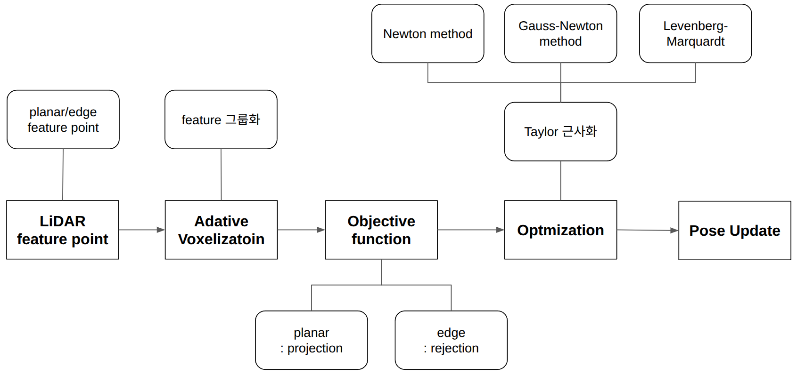
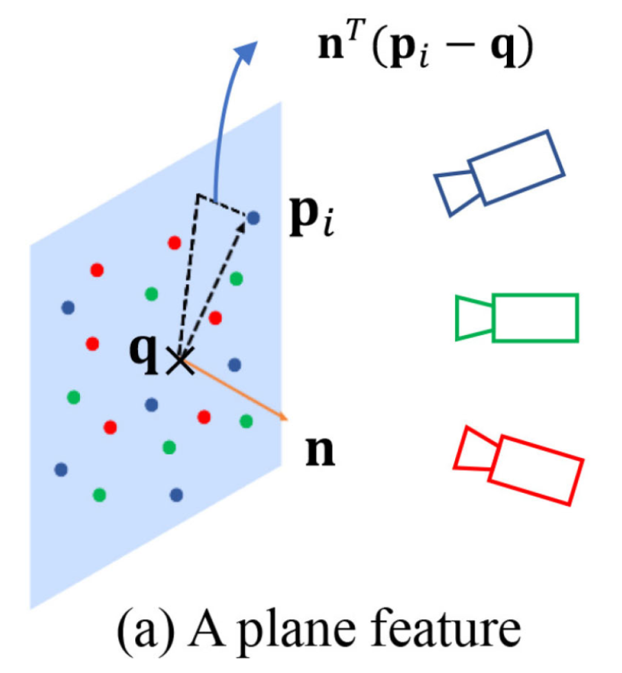
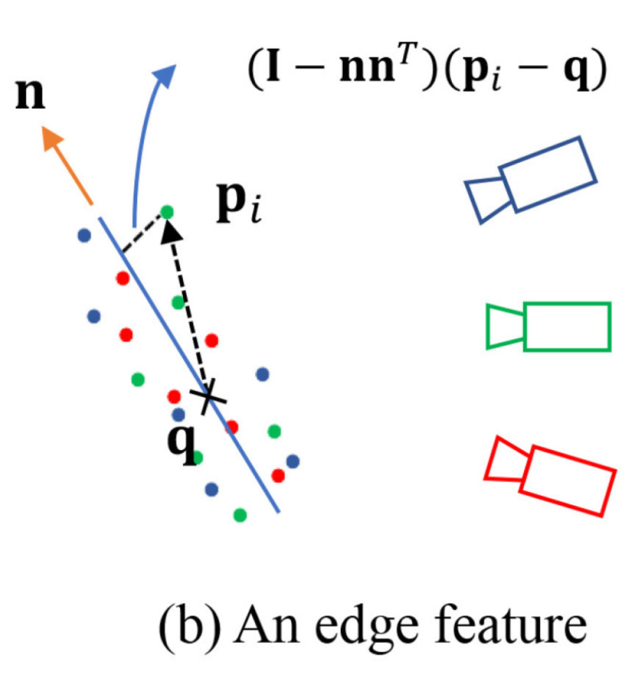
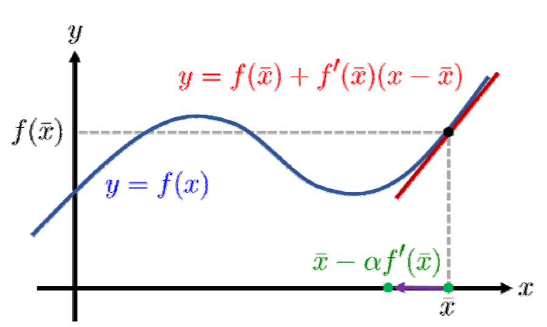
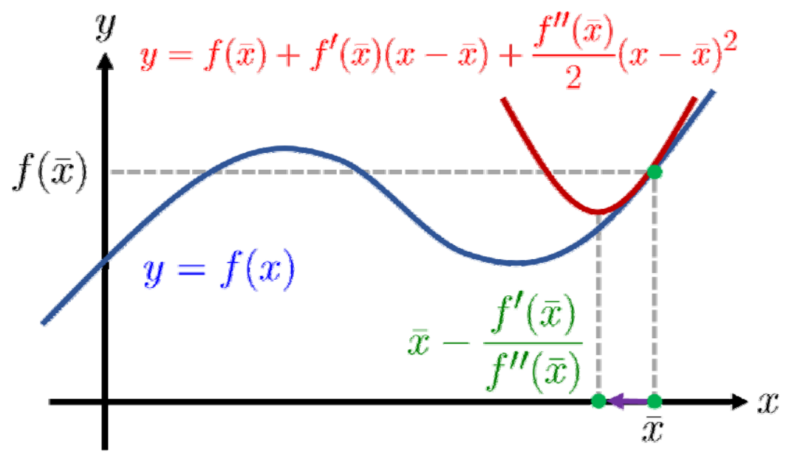

## Overview
.nt-02.center[

]

---
## Projection
.nt-02.pull-left-45[

]
.nt-02.pull-right-55.f-85[
  - **Projection Vector**
  - **내적(dot product)** :   
$$\mathbf{a} \cdot \mathbf{b} = \|\mathbf{a}\|\|\mathbf{b}\|\cos\theta = (\|\mathbf{a}\|\cos\theta)\|\mathbf{b}\|$$
  - **projection의 크기** : 
$$\|\mathbf{a}_{\parallel}\| = \frac{\mathbf{a} \cdot \mathbf{b}}{\|\mathbf{b}\|} = \|\mathbf{a}\|\cos\theta$$
  - **projection의 방향**:
$$\hat{\mathbf{a}_{\parallel}} = \hat{\mathbf{b}} = \frac{\mathbf{b}}{\|\mathbf{b}\|}$$
  - **Projection vector = 방향 x 크기**
$$\therefore \mathbf{a}_{\parallel} = \|\mathbf{a}_{\parallel}\| \cdot \hat{\mathbf{a}}_{\parallel} = \frac{\mathbf{a} \cdot \mathbf{b}}{\|\mathbf{b}\|} \cdot \frac{\mathbf{b}}{\|\mathbf{b}\|} = \frac{(\mathbf{b}\mathbf{b}^\top)}{\mathbf{b}^\top\mathbf{b}}\mathbf{a}$$
]
---
## Projection
.nt-02.pull-left-45[

]
.nt-02.pull-right-55.f-85[
  - **Rejection vector**  
  - a에서 b방향 성분을 제거 하고 남은 벡터
$$\mathbf{a} = \mathbf{a}_{\parallel} + \mathbf{a}_{\perp}$$
$$\mathbf{a}_{\perp} = \mathbf{a} - \mathbf{a}_{\parallel}$$
- $\mathbf{a}_{\perp}$는 $\mathbf{b}$에 수직한 방향이므로 $\mathbf{a}_{\perp} \cdot \mathbf{b} = 0$
- 앞에서 Projection한 $\mathbf{a}_{\parallel}$은
$$\mathbf{a}_{\parallel} = \frac{(\mathbf{b}\mathbf{b}^\top)}{\mathbf{b}^\top\mathbf{b}}\mathbf{a}$$
- 따라서 $\mathbf{a}_{\perp}$는
$$\mathbf{a}_{\perp} = \mathbf{a} - \frac{(\mathbf{b}\mathbf{b}^\top)}{\mathbf{b}^\top\mathbf{b}}\mathbf{a} = 
\left( \mathbf{I} - \frac{(\mathbf{b}\mathbf{b}^\top)}{\mathbf{b}^\top\mathbf{b}} \right) \mathbf{a}$$
]
---
## Projection
.nt-02.pull-left-45[

]
.nt-02.pull-right-55.f-85[
  - Plane feature : 벡터가 평면에 투영된 결과
$$\mathbf{n}^\top(\mathbf{p}_i - \mathbf{q})$$
  - $\mathbf{n}$ : 평면의 법선 벡터, $\mathbf{q}$ : 평면 위의 한 점- $\mathbf{p}_i$ : 투영하려는 벡터
- $\mathbf{e}=\mathbf{p}_i - \mathbf{q}$라 정의하면, 위 식은 $\mathbf{e}$를 평면의 normal vector에 projection한 결과

]
---
## Projection
.nt-02.pull-left-45[

]
.nt-02.pull-right-55.f-85[
  - Edge feature : 벡터가 선에 투영된 결과
$$(\mathbf{I}-\mathbf{nn}^\top)(\mathbf{p}_i - \mathbf{q})$$
  - $\mathbf{n}$ : 선의 방향 벡터, $\mathbf{q}$ : 선 위의 한 점- $\mathbf{p}_i$ : 투영하려는 벡터
- $\mathbf{e}=\mathbf{p}_i - \mathbf{q}$라 정의하면, 위 식은 $\mathbf{e}$를 선의 direction vector에 projection한 결과를 $\mathbf{e}$에서 빼서 선에 수직한 방향으로 남긴 결과
$$\mathbf{e} = \mathbf{e}_\perp + \mathbf{e}_\parallel \rightarrow \mathbf{e}_\perp = \mathbf{e}-\mathbf{e}_\parallel$$
$$\mathbf{e}_\perp = \mathbf{e}-\frac{\mathbf{n} \cdot \mathbf{n}^\top}{\mathbf{n} \cdot \mathbf{n}} \mathbf{e} 
= (\mathbf{I}-\frac{\mathbf{n} \cdot \mathbf{n}^\top}{\mathbf{n} \cdot \mathbf{n}}) \mathbf{e}$$
]
---
## Optimization
.nt-02.f-85[
  - non-linear optimization는 직접 풀기 어렵기 때문에 미분과 Taylor 근사를 이용함
- **다변수 스칼라 함수 편미분**
$$y \in \mathbb{R}, \mathbf{x}=[x_1, x_2, \dots, x_n]^\top \in \mathbb{R}^n$$
$$\frac{\partial y}{\partial \mathbf{x}} = \left[ \frac{\partial y}{\partial x_1}, \frac{\partial y}{\partial x_2}, \dots, \frac{\partial y}{\partial x_n} \right] \in \mathbb{R}^{1 \times n}$$
$$\nabla y = (\frac{\partial y}{\partial \mathbf{x}})^\top \in \mathbb{R}^{n\times 1}$$
  - 스칼라 함수 $y$를 벡터 $\mathbf{x}$로 편미분하면, 편미분 결과는 $\mathbf{x}$의 각 원소에 대한 편미분값을 원소로 하는 행벡터가 됨
]
???
$$\frac{\partial(\mathbf{x}^\top \mathbf{A} \mathbf{x})}{\partial \mathbf{x}} = 
2\mathbf{x}^\top \mathbf{A} \in \mathbb{R}^{1 \times n}$$
$$\mathbf{A}=\mathbf{A}^\top$$
---
## Optimization
.nt-02.f-85[
- **다변수 벡터 함수 편미분**
$$\mathbf{y}=[y_1, y_2, \dots, y_m]^\top \in \mathbb{R}^m, \mathbf{x}=[x_1, x_2, \dots, x_n]^\top \in \mathbb{R}^n$$
$$\frac{\partial \mathbf{y}}{\partial \mathbf{x}} = \begin{bmatrix} \frac{\partial y_1}{\partial x_1} & \frac{\partial y_1}{\partial x_2} & \dots & \frac{\partial y_1}{\partial x_n} \\ \frac{\partial y_2}{\partial x_1} & \frac{\partial y_2}{\partial x_2} & \dots & \frac{\partial y_2}{\partial x_n} \\ \vdots & \vdots & \ddots & \vdots \\ \frac{\partial y_m}{\partial x_1} & \frac{\partial y_m}{\partial x_2} & \dots & \frac{\partial y_m}{\partial x_n} \end{bmatrix} \in \mathbb{R}^{m \times n}$$
  - 벡터 함수 $\mathbf{y}$를 벡터 $\mathbf{x}$로 편미분하면, 편미분 결과는 $y_i$의 각 원소에 대한 편미분값을 원소로 하는 행렬이 됨
$$\frac{\partial \mathbf{Ax}}{\partial \mathbf{x}} = \mathbf{A}$$
]
---
## Optimization
.nt-02.f-85[
- **Taylor approximation (다변수 스칼라 함수)**
  - **입력이 벡터, 출력이 스칼라** $f(\mathbf{x})\in \mathbb{R}, \mathbf{x} \in \mathbb{R}^n$를 $\mathbf{x}=\bar{\mathbf{x}}$에서 1차 approximation하면,
$$f(\mathbf{x}) = 
f(\overline{\mathbf{x}}) + 
\nabla f(\overline{\mathbf{x}})^\top (\mathbf{x} - \overline{\mathbf{x}}) + 
\frac{1}{2}(\mathbf{x} - \overline{\mathbf{x}})^\top \mathbf{H}(\overline{\mathbf{x}})(\mathbf{x} - \overline{\mathbf{x}}) + 
\cdots$$
- $\mathbf{x}=[x_1, x_2, \dots, x_n]^\top$일때 Gradient $\nabla f \in \mathbb{R}^n$, Hessian $\mathbf{H} \in \mathbb{R}^{n \times n}$는 다음과 같다.
$$\nabla f = 
\begin{bmatrix} 
\frac{\partial f}{\partial x_1} \\
\frac{\partial f}{\partial x_2} \\
\vdots \\
\frac{\partial f}{\partial x_n} 
\end{bmatrix}, \quad
\mathbf{H} = 
\begin{bmatrix} 
\frac{\partial^2 f}{\partial x_1^2} & \frac{\partial^2 f}{\partial x_1 \partial x_2} & \dots & \frac{\partial^2 f}{\partial x_1 \partial x_n} \\
\frac{\partial^2 f}{\partial x_2 \partial x_1} & \frac{\partial^2 f}{\partial x_2^2} & \dots & \frac{\partial^2 f}{\partial x_2 \partial x_n} \\
\vdots & \vdots & \ddots & \vdots \\
\frac{\partial^2 f}{\partial x_n \partial x_1} & \frac{\partial^2 f}{\partial x_n \partial x_2} & \dots & \frac{\partial^2 f}{\partial x_n^2} 
\end{bmatrix}$$
- 다변수 스칼라 함수 정의에 따라 gradient $\nabla f = (\frac{\partial f}{\partial \mathbf{x}})^\top$, Hessian $\mathbf{H} = \frac{\partial \nabla f}{\partial \mathbf{x}}$로 표현가능
]
---
## Optimization
.nt-02.f-85[
  - **Taylor approximation (다변수 벡터 함수)**
  - **입력/출력 모두 벡터** $\mathbf{f}(\mathbf{x}) \in \mathbb{R}^m, \mathbf{x} \in \mathbb{R}^n$를 $\mathbf{x}=\bar{\mathbf{x}}$에서 1차 approximation하면,
$$\mathbf{f}(\mathbf{x}) = \mathbf{f}(\bar{\mathbf{x}}) + 
\mathbf{J}(\bar{\mathbf{x}})(\mathbf{x} - \bar{\mathbf{x}})+\cdots$$

- $\mathbf{f}=[f_1, f_2, \dots, f_m]^\top$일때 Jacobian $\mathbf{J} \in \mathbb{R}^{m \times n}$는 다음과 같다.
$$\mathbf{J} = 
\begin{bmatrix} 
\frac{\partial f_1}{\partial x_1} & \frac{\partial f_1}{\partial x_2} & \dots & \frac{\partial f_1}{\partial x_n} \\
\frac{\partial f_2}{\partial x_1} & \frac{\partial f_2}{\partial x_2} & \dots & \frac{\partial f_2}{\partial x_n} \\
\vdots & \vdots & \ddots & \vdots \\
\frac{\partial f_m}{\partial x_1} & \frac{\partial f_m}{\partial x_2} & \dots & \frac{\partial f_m}{\partial x_n} 
\end{bmatrix}$$
- 다변수 벡터 함수 미분 정의에 따르면 $\mathbf{J} = \frac{\partial \mathbf{f}}{\partial \mathbf{x}} \in \mathbb{R}^{m \times n}$
]

---
## Optimization
.nt-02.f-85[
  - **Gradient**
$$\nabla f = (\frac{\partial f}{\partial \mathbf{x}})^\top$$
  - loss function이 가장 빨리 증가하는 방향, $-\nabla f$는 가장 빨리 감소하는 방향
  - gradient는 loss를 줄이기 위해 어디로 가야하는지 알려줌
  - cost를 줄이기 위해서 어느 방향으로 가야하는지 알려주는 벡터
- **Hessian**
$$\mathbf{H} = \frac{\partial \nabla f}{\partial \mathbf{x}}$$
  - loss function의 curvature를 나타냄. gradient의 변화율
  - Hessian은 표면이 어느정도로 휘어져있는지 알려줌
  - 방향의 곡률과 얼마나 조절해야하는지 알려주는 행렬
]

---
## Optimization
.nt-02.f-85[
  - **Jacobian**
$$\mathbf{J} = \frac{\partial \mathbf{f}}{\partial \mathbf{x}} \in \mathbb{R}^{m \times n}$$
  - 벡터 함수 $\mathbf{f}$의 각 원소 $f_i$가 벡터 $\mathbf{x}$의 각 원소 $x_j$에 대해 어떻게 변화하는지 나타냄
  - Jacobian은 벡터 함수의 변화율을 나타냄. $\mathbf{f}$가 $\mathbf{x}$에 대해 어떻게 변화하는지 알려줌
  - 입력 $\mathbf{x}$가 조금 변할 때, 출력 $\mathbf{f}$가 얼마나 변하는지 나타내는 행렬

- 최적화 문제는 목적함수 $f(\mathbf{x})\in \mathbb{R}^m$가 주어졌을때 최소화하는 최적해 $\mathbf{x}^*\in \mathbb{R}^n$를 찾는 문제
$$\mathbf{x}^* = \arg\min_{\mathbf{x}} f(\mathbf{x})$$
  - $f(\mathbf{x})$가 가장 작은 $\mathbf{x}^*$를 찾는 문제
- **gradient method** : 1차 Taylor approximation 이용
- **Newton method** : 2차 Taylor approximation 이용
]
---
## Optimization
.nt-02.pull-left-60.f-85[
  - **다변수 스칼라 함수 gradient 방법**
  - $f(\mathbf{x})\in\mathbb{R}, \mathbf{x} \in \mathbb{R}^n$를 $\mathbf{x}=\bar{\mathbf{x}}$에서 1차 approximation하면,
$$f(\mathbf{x}) \approx f(\bar{\mathbf{x}}) + \nabla f(\bar{\mathbf{x}})^\top (\mathbf{x} - \bar{\mathbf{x}})$$
- gradient $\nabla f(\bar{\mathbf{x}})$는 $\bar{\mathbf{x}}$에서 $f$가 가장 빠르게 증가하는 방향을 나타냄 (-)를 붙여서 반대로 가면 $f$가 가장 빠르게 감소하는 방향이 됨

- update : $\bar{\mathbf{x}} \leftarrow \bar{\mathbf{x}} - \alpha \nabla f(\bar{\mathbf{x}})$
  - $\alpha$ : learning rate, step size. 너무 크면 발산, 너무 작으면 수렴이 느려짐
  - $\alpha$값으로 gradient가 얼만큼 가야하는지 결정
- gradient는 방향정보, 1차 근사는 접평면근사, gradient descent는 기울기 반대방향으로 이동
]
.nt-02.pull-right-35.f-85[
- gradient descent

]
---
## Optimization
.nt-02.pull-left-60.f-85[
  - **Newton 방법**
  - $f(\mathbf{x})\in\mathbb{R}, \mathbf{x}\in\mathbb{R}^n$을 한점 $\mathbf{x}=\bar{\mathbf{x}}$에서 2차 approximation하면,
$$f(\mathbf{x}) \approx f(\bar{\mathbf{x}}) + \nabla f(\bar{\mathbf{x}})^\top (\mathbf{x} - \bar{\mathbf{x}}) + \frac{1}{2} (\mathbf{x} - \bar{\mathbf{x}})^\top \mathbf{H}(\bar{\mathbf{x}}) (\mathbf{x} - \bar{\mathbf{x}})$$
$$\frac{\partial f(\mathbf{x})}{\partial \mathbf{x}} = \nabla f(\bar{\mathbf{x}}) + \mathbf{H}(\bar{\mathbf{x}})(\mathbf{x} - \bar{\mathbf{x}})$$
- 최소가 되는곳은 $\frac{\partial f(\mathbf{x})}{\partial \mathbf{x}} = 0$인 지점. $\delta{\mathbf{x}} = \mathbf{x} - \bar{\mathbf{x}}$라 해, normal equation을 풀면,
$$\mathbf{H}(\bar{\mathbf{x}})\delta\mathbf{x} = -\nabla f(\bar{\mathbf{x}})$$
- 위 식의 해를 $\bar{\mathbf{x}} \leftarrow \bar{\mathbf{x}} + \delta \mathbf{x}$에 대입하면,
  
- update : $\bar{\mathbf{x}} \leftarrow \bar{\mathbf{x}} - \mathbf{H}(\bar{\mathbf{x}})^{-1} \nabla f(\bar{\mathbf{x}})$
]
.nt-02.pull-right-35.f-85[
- Hessian

]
---
## Optimization
.nt-02.f-85[
- **Gauss-Newton 방법**
  - $m$개의 데이터에서 $i$번째 residual 함수 $e_i(\mathbf{x})\in\mathbb{R}, \mathbf{x}\in\mathbb{R}^n$가 주어졌을 때, 손실함수는 
  - $\mathbf{e}(\mathbf{x}) = [e_1(\mathbf{x}), e_2(\mathbf{x}), \dots, e_m(\mathbf{x})]^\top\in\mathbb{R}^m$은 residual vector
$$f(\mathbf{x}) = \frac{1}{2} \sum_{i=1}^m {e_i}^2(\mathbf{x}) = \frac{1}{2} \mathbf{e}(\mathbf{x})^\top \mathbf{e}(\mathbf{x})$$
- $\mathbf{e}(\mathbf{x})$를 taylor approximation를 이용해서 $\mathbf{x}=\bar{\mathbf{x}}$에서 1차 approximation하면,
$$\mathbf{e}(\mathbf{x}) \approx \mathbf{e}(\bar{\mathbf{x}}) + \mathbf{J}_e(\bar{\mathbf{x}})(\mathbf{x} - \bar{\mathbf{x}})$$
- $\bar{\mathbf{e}}=\mathbf{e}(\bar{\mathbf{x}})$, $\bar{\mathbf{J}_e}=\mathbf{J}_e(\bar{\mathbf{x}})$라 하고, approximation식을 손실함수에 대입하면,
$$f(\mathbf{x}) \approx 
\frac{1}{2} 
(\bar{\mathbf{e}} + \bar{\mathbf{J}_e}(\mathbf{x} - \bar{\mathbf{x}}))^\top 
(\bar{\mathbf{e}} + \bar{\mathbf{J}_e}(\mathbf{x} - \bar{\mathbf{x}}))$$
$$f(\mathbf{x}) \approx 
\frac{1}{2}
\bar{\mathbf{e}}^\top \bar{\mathbf{e}} + 
\bar{\mathbf{J}_e}^\top \bar{\mathbf{e}}(\mathbf{x} - \bar{\mathbf{x}}) + 
\frac{1}{2}(\mathbf{x} - \bar{\mathbf{x}})^\top \bar{\mathbf{J}}_e^\top \bar{\mathbf{J}}_e(\mathbf{x} - \bar{\mathbf{x}})$$
]
---
## Optimization
.nt-02.f-85[
- **Gauss-Newton 방법**
  - Newton 방법의 2차 근사식과 비교하면,
$$\nabla f(\bar{\mathbf{x}}) \approx \bar{\mathbf{J}_e}^\top \bar{\mathbf{e}}\in \mathbb{R}^n$$ 
$$\mathbf{H}_f(\bar{\mathbf{x}}) \approx \bar{\mathbf{J}_e}^\top \bar{\mathbf{J}_e} \in \mathbb{R}^{n \times n}$$  
- Newton 방법의 normal equation과 비교하면,
$$\bar{\mathbf{J}_e}^\top \bar{\mathbf{J}_e} \delta \mathbf{x} = -\bar{\mathbf{J}_e}^\top \bar{\mathbf{e}}$$
  - $\bar{\mathbf{J}_e}^\top \bar{\mathbf{J}_e}$는 Hessian의 근사값, $\bar{\mathbf{J}_e}^\top \bar{\mathbf{e}}$는 gradient의 근사값
- update는 $\bar{\mathbf{x}} \leftarrow \bar{\mathbf{x}} + \delta \mathbf{x}$에 대입하면,
$$\bar{\mathbf{x}} \leftarrow 
\bar{\mathbf{x}} - 
(\bar{\mathbf{J}_e}^\top \bar{\mathbf{J}_e})^{-1} \bar{\mathbf{J}_e}^\top \bar{\mathbf{e}}$$
]
---
## Optimization
.nt-02.f-85[
- **Levenberg-Marquardt 방법**
  - Gauss-Newton의 normal equation을 풀 때, $(\bar{\mathbf{J}_e}^\top \bar{\mathbf{J}_e})^{-1}$가 불안정하지 않게 damping term을 추가한 방법
$$(\bar{\mathbf{J}_e}^\top \bar{\mathbf{J}_e} + \lambda \mathbf{I})\delta{\mathbf{x}} =
-\bar{\mathbf{J}_e}^\top \bar{\mathbf{e}}$$
- update는 $\bar{\mathbf{x}} \leftarrow \bar{\mathbf{x}} + \delta \mathbf{x}$에 대입하면,
$$\bar{\mathbf{x}} \leftarrow 
\bar{\mathbf{x}} - 
(\bar{\mathbf{J}_e}^\top \bar{\mathbf{J}_e} + \lambda \mathbf{I})^{-1} \bar{\mathbf{J}_e}^\top \bar{\mathbf{e}}$$
- $\lambda = 0$이면, Gauss-Newton 방법과 같고, $\lambda ≫ 0$이면, gradient 방법과 같음
  - $\lambda = 0 : \bar{\mathbf{x}} \leftarrow \bar{\mathbf{x}} - (\bar{\mathbf{J}_e}^\top \bar{\mathbf{J}_e})^{-1} \bar{\mathbf{J}_e}^\top \bar{\mathbf{e}}$ (Gauss-Newton)
  - $\lambda ≫ 0 : \bar{\mathbf{x}} \leftarrow \bar{\mathbf{x}} - \frac{1}{\lambda} \bar{\mathbf{J}_e}^\top \bar{\mathbf{e}} \approx \bar{\mathbf{x}} - \alpha \nabla f(\bar{\mathbf{x}})$ (Gradient) 
]

---
## BALM Optimization
.nt-02.f-85[
- BALM의 목적함수
$$f(\mathbf{T})=\lambda_k(\mathbf{p}(\mathbf{T}))$$
  - point vector $\mathbf{p} = [\mathbf{p}^\top_1, \mathbf{p}^\top_2, \dots, \mathbf{p}^\top_N]^\top$에 대해 미분을 전개후 chain rule로 $\mathbf{T}$에 대한 미분, $\mathbf{T}$에대한 2차 approximation 진행
$$\frac{\partial f}{\partial \mathbf{T}}=\frac{\partial\lambda_k}{\partial \mathbf{p}} \frac{\partial \mathbf{p}}{\partial \mathbf{T}}$$
- point vector $\mathbf{p}$에 대한 cost를 2차 Taylor로 approximation
$$\lambda_k(\mathbf{p} + \delta\mathbf{p}) \approx 
\lambda_k(\mathbf{p}) + 
\mathbf{J}(\mathbf{p})\delta\mathbf{p} + 
\frac{1}{2}\delta\mathbf{p}^T \mathbf{H}(\mathbf{p})\delta\mathbf{p}$$
  - $\lambda_k(\mathbf{p})$는 **스칼라 함수**, $\mathbf{p}$는 **벡터**이므로, $\mathbf{J}(\mathbf{p})$는 Jacobian이 아닌 **gradient**, $\mathbf{H}(\mathbf{p})$는 Hessian
  - scalar cost 함수 $\lambda_k(\mathbf{p})$를 vector $\mathbf{p}$에 대해 2차 approximation 한것 
]
---
## BALM Optimization
.nt-02.f-85[
- pose $\mathbf{T}$ pertubation
$$\mathbf{T}_j=[\mathbf{R}_j \quad \mathbf{t}_j] \rightarrow
\delta \mathbf{T}_j = \left[ \boldsymbol{\phi}_j^\top \quad \delta \mathbf{t}_j^\top \right]^\top$$
  - j번째 scan에서 회전/이동을 할것인지에 대한 update, pose가 변하면 global point $\mathbf{p}_i$도 변하므로 $\delta\mathbf{p}_i$ 생김,
- rotation은 지수맵으로 업데이트, translation은 벡터 덧셈으로 업데이트
$$\mathbf{T}_j = (\mathbf{R}_j, \mathbf{t}_j); \quad \mathbf{T}_j \boxplus \delta \mathbf{T}_j = (\mathbf{R}_j \exp (\phi_j^\wedge), \mathbf{t}_j + \delta \mathbf{t}_j)$$

  - translation은 $\mathbb{R}^3$에서 벡터 덧셈 가능, rotation은 **SO(3)**에서 지수맵으로 업데이트
  - global point : $\mathbf{p}_i'=\mathbf{R}_{s_i}\mathbf{p}_{f_i} + \mathbf{t}_{s_i}$, perturbation 이후는 $\mathbf{p}_i'=\mathbf{R}_{s_i} \exp(\phi_{s_i}^\wedge) \mathbf{p}_{f_i} + \mathbf{t}_{s_i} + \delta \mathbf{t}_{s_i}$
]
???
$$\mathbf{p}_i = \mathbf{R}_{s_i} \exp(\phi_{s_i}^\wedge) \mathbf{p}_{f_i} + \mathbf{t}_{s_i}; \quad \frac{\delta \mathbf{p}_i}{\delta \mathbf{T}_{s_i}} = \left[ -\mathbf{R}_{s_i} (\mathbf{p}_{f_i})^\wedge \quad \mathbf{I} \right]$$
$$\mathbf{D}=\frac{\delta {\mathbf{p}}}{\delta {\mathbf{T}}}, \quad \delta{\mathbf{p}}=\mathbf{D}\delta{\mathbf{T}}$$
---
## BALM Optimization
.nt-02.f-80[
- $\exp(\phi^\wedge)$를 taylor전개를 하면 $\exp(\phi^\wedge) \approx \mathbf{I} + \phi^\wedge + \frac{1}{2}(\phi^\wedge)^2 + \dots$로, $\exp(\phi^\wedge) \approx \mathbf{I} + \phi^\wedge$와 같다
$$\begin{align*}
\mathbf{p}'_i &\approx 
\mathbf{R}_{s_i}(\mathbf{I} + \phi_{s_i}^\wedge)\mathbf{p}^f_i + \mathbf{t}_{s_i} + \delta\mathbf{t}_{s_i} \\[2ex]
&= 
\mathbf{R}_{s_i}\mathbf{p}^f_i + \mathbf{t}_{s_i} + \mathbf{R}_{s_i}\phi_{s_i}^\wedge\mathbf{p}^f_i + \delta\mathbf{t}_{s_i}
\end{align*}$$
$$\delta\mathbf{p}_i = \mathbf{p}_i' - \mathbf{p}_i \approx \mathbf{R}_{s_i}\phi_{s_i}^\wedge\mathbf{p}^f_i + \delta\mathbf{t}_{s_i}$$
- skew-symmetric matrix 특성 이용해서, $\phi^\wedge\mathbf{p}=-\mathbf{p}^\wedge\phi$
$$\delta\mathbf{p}_i \approx -\mathbf{R}_{s_i}(\mathbf{p}^f_i)^\wedge \phi_{s_i} + \delta\mathbf{t}_{s_i}$$
- 행렬 형태 적용하면 $\mathbf{D}=\delta\mathbf{p}_i = \left[ -\mathbf{R}_{s_i}(\mathbf{p}^f_i)^\wedge \quad \mathbf{I} \right] \begin{bmatrix} \boldsymbol{\phi}_{s_i} \\ \delta\mathbf{t}_{s_i} \end{bmatrix}$ 정리하면,
$$\mathbf{D}=\frac{\delta {\mathbf{p}}}{\delta {\mathbf{T}}}, \quad \delta{\mathbf{p}}=\mathbf{D}\delta{\mathbf{T}}$$
]
---
## BALM Optimization
.nt-02.f-85[
- 2차 근사식에 $\delta\mathbf{p}=\mathbf{D}\delta\mathbf{T}$ 대입하면,
  - 1차항 : $\mathbf{J}(\mathbf{p})\delta\mathbf{p} = \mathbf{J}(\mathbf{p})\mathbf{D}\delta\mathbf{T}$
  - 2차항 : $\delta\mathbf{p}^\top \mathbf{H}(\mathbf{p})\delta\mathbf{p} = (\mathbf{D}\delta\mathbf{T})^\top \mathbf{H}(\mathbf{p}) (\mathbf{D}\delta\mathbf{T}) = \delta\mathbf{T}^\top \mathbf{D}^\top \mathbf{H}(\mathbf{p}) \mathbf{D} \delta\mathbf{T}$

- pose $\mathbf{T}$에 대한 2차 근사식, chain rule 결과
$$\lambda_k(\mathbf{T} \boxplus \delta\mathbf{T}) \approx 
\lambda_k(\mathbf{T}) + \mathbf{J}\mathbf{D}\delta\mathbf{T} + 
\frac{1}{2}\delta\mathbf{T}^\top \mathbf{D}^\top \mathbf{H} \mathbf{D} \delta\mathbf{T}$$
- $\bar{\mathbf{J}} = \mathbf{J}\mathbf{D}, \quad \bar{\mathbf{H}} = \mathbf{D}^\top \mathbf{H} \mathbf{D}$로 표현하면,
$$\lambda_k(\mathbf{T} \boxplus \delta\mathbf{T}) \approx 
\lambda_k(\mathbf{T}) + \bar{\mathbf{J}}\delta\mathbf{T} + 
\frac{1}{2}\delta\mathbf{T}^\top \bar{\mathbf{H}} \delta\mathbf{T}$$
]

---
## BALM Optimization
.nt-02.f-85[
- **LM update 방법 적용**
$$(\bar{\mathbf{H}}(\mathbf{T}) + \mu\mathbf{I})\delta\mathbf{T}^* = -\bar{\mathbf{J}}(\mathbf{T})^\top$$
  - $\mu$ : damping term, $\delta\mathbf{T}^*$ : update할 pose perturbation
  
- eigenvalue cost를 2차 approximation하고, LM Update방법을 이용해 pose perturbation $\delta\mathbf{T}^*$를 구하는 과정

]
---
## Conclusion
.nt-02.f-90[
- 기하학적인 관점에서 planar cost는 **projection**, edge cost는 **rejection**으로 표현 가능

- BALM의 목적함수는 eigenvalue cost로 표현 가능, eigenvalue cost는 스칼라 함수이므로, point vector에 대한 2차 Taylor approximation 가능

- **즉, Newton method처럼 2차 approximation를 하고, chain rule로 pose perturbation에 대한 근사식을 구한 후, LM update 방법을 이용해서 pose perturbation $\delta\mathbf{T}^*$를 구하는 과정**

- local BA를 통해 일관된 local map을 만들 수 있고, local map이 일관되면 global map도 일관되게 됨
]
---
## Limitation
.nt-02.f-90[
- initial guess가 좋지 않으면, local minimum에 빠지거나 voxelization이 안정적으로 구성되지않음 
-> keyframe 기반 local BA 채용

- feature가 부족한 환경에서 결과가 안좋음
-> LIO계열로 변경하거나, raw point cloud를 이용하는 방법으로 변경

- Loop closure의 부재로 loop가 있는 환경에서는 drift 발생
-> Loop closure 추가하거나 STD같은 place recognition 방법 추가
]

???
approximation 방법? -> 테일러 전개
gradient : 스칼라를 벡터로 미분 -> 행벡터 1xn
hessian : gradient를 벡터로 미분 -> 행렬 nxn
jacobian : 오차벡터를 벡터로 미분 -> 행렬 mxn